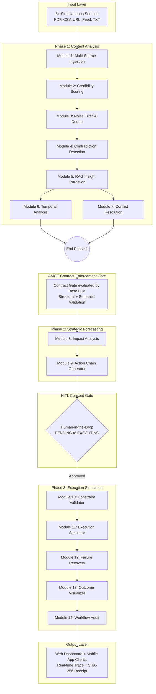

# System Architecture Document
**Autonomous Content-to-Action Agent**

This document serves as the deeply technical architectural reference for the Autonomous Content-to-Action Agent. It outlines the holistic pipeline workflow, orchestration principles via Google Antigravity, the multi-provider LLM load-balancing architecture, AMCE contract verification mechanics, dual-phase pipeline states, and cross-layer API integrations.

---

## 1. Complete System Overview Diagram



### Architectural Pipeline Flow
1. **Input Layer:** Multi-modal data buffers are pushed into the pipeline containing real-world representations of potential crises.
2. **Phase 1 (Content Analysis):** Raw sources are structured and normalized (M1). Sources receive a deterministic trust score (M2). A local vector space embeddings lookup deduplicates highly similar data points (M3). Cross-referencing claim extraction actively finds semantic contradictions (M4), followed by RAG synthesis (M5). The pipeline branches via `Promise.all` into detecting linear regression trends (M6) and resolving factual conflicts via credibility-weighting (M7).
3. **AMCE Contract Enforcement Gate:** Every module's output is rigorously tested structurally via Zod and semantically verified by an independent base model before propagating downwards. 
4. **Phase 2 (Strategic Forecasting):** Financial, operational, and reputational scopes are calculated (M8), feeding into the creation of 3–5 topologically linked tactical execution proposals (M9).
5. **HITL Consent Gate:** The pipeline pauses at a `PENDING` state, actively streaming its proposed action graph to web and mobile operators for cryptographic, biometrically secured approval.
6. **Phase 3 (Execution Simulation):** Hard constraints like budgets and urgency limits are enforced (M10). Actions are topologically sorted via Kahn's algorithm and executed in sequence (M11). Simulated network anomalies trigger fallback and cascade skip behavior (M12). Quantitative visual outcomes are generated (M13) before finalizing an immutable, SHA-256 signed compliance ledger record (M14).
7. **Output Layer:** Clients react to Server-Sent Event (SSE) streams, rendering state UI updates, live traces, and finally displaying the auditable cryptographic certificate.

---

## 2. Google Antigravity Orchestration Architecture

**What Antigravity IS in this system:**
Google Antigravity serves as the centralized reasoning and coordination brain. It is decidedly **not** a basic API wrapper. During a pipeline invocation, Antigravity executes highly intelligent administrative operations:

1. Generates a structured **Workplan**—a high-level, human-readable natural language outline of the pipeline's operational objectives.
2. Formulates a rigorous **Task Plan**—an explicitly ordered catalog mapping 14+ discrete tasks directly to specific code modules.
3. Rapidly dispatches each module as an isolated **sub-agent task**, supplying distinct inputs, anticipating defined interface outputs, and validating strict contract requirements.
4. Intelligently evaluates output reasoning quality using the internal AMCE contract layer proxy.
5. Employs independent **recovery decisions** upon encountering contract infractions (choosing between re-generation prompts vs baseline fallbacks).
6. Actively logs every single tool call execution, granular LLM invocation, and overarching strategic decision as a discrete **Reasoning Step**.
7. Formulates a robust, immutable **Audit Trace** allowing judges to intricately inspect the fundamental validity of the system's logic loops.

**Antigravity Trace Structure:**
The system generates a highly dense JSON trace. Below is an example based on the Inventory Shortage scenario:

```json
{
  "pipeline_id": "8b52f6d0-a3bc-4f76-9c40-3b8a1c9e8d1a",
  "environment": "production",
  "ai_provider_used": "vertex-ai",
  "workplan": "Resolve acute inventory shortage across multi-modal reports by prioritizing high-credibility sales signals over lagging PDF datasets.",
  "task_plan": [
    "Task 1: Execute Multi-Source Ingestion",
    "Task 2: Execute Credibility Scoring..."
  ],
  "reasoning_steps": [
    {
      "step": 4,
      "agent": "contradiction_detector",
      "reasoning": "Detected 90% numeric divergence between PDF SRC-001 (500 units) and CSV SRC-002 (Out of stock). Conflict identified.",
      "decision": "Flagging as CRITICAL severity contradiction requiring resolution.",
      "confidence": 0.98
    }
  ],
  "tool_calls": [
    {
      "tool": "InMemoryVectorStore.search",
      "parameters": { "query": "stock units", "top_k": 5 }
    }
  ],
  "action_execution": [
    { "action_id": "ACT-001", "status": "COMPLETED", "cost": 450000 }
  ],
  "recovery_steps": [
    {
      "action_id": "ACT-003",
      "strategy": "RETRY",
      "attempt": 1,
      "reason": "Simulated 503 Gateway Timeout"
    }
  ],
  "contract_decisions": [
    {
      "module": "strategic_recommender",
      "decision": "PASS",
      "violations": []
    }
  ]
}
```

**Why Antigravity is not replaceable:** Without Antigravity, there is no workplan, no systematic reasoning trace, and no transparent task progression. Without it, the judges would simply review raw API text blobs void of context. Antigravity dynamically bridges 14 isolated Express endpoints into a single, cohesive, self-reflecting cognitive engine.

---

## 3. The LLMClient Multi-Provider Architecture

The architecture surrounding the LLM integration represents an enterprise-grade focus on operational resilience and cost management.

**The Singleton Pattern:**
All 14 agents rigorously import a singleton `{ llmClient }` from `../utils/llm-client`. Zero agents bypass this to directly import `@google/generative-ai` or `groq-sdk`. This allows a seamless, centralized switch of the underlying provider logic without fragmenting configuration across multiple files.

**The Three-Tier Fallback Chain:**
```
Tier 1: Vertex AI (production) / Gemini Free (development)
    ↓ [Triggered by 429 Rate Limits, Quota Exceeded, Billing Errors, Timeouts]
Tier 2: Gemini Free (production fallback) / Groq (development fallback)
    ↓ [Triggered by continued catastrophic failure]
Tier 3: Groq (emergency fallback in production) / Throws exception (development)
```

**Vertex Account Rotation Logic:**
The platform leverages a robust `VERTEX_ACCOUNTS` array containing configurations for two GCP accounts (Person B and Person C), mapped to a $4.50 hard spending limit per account. Upon hitting `account.spent >= account.limit` or receiving a quota error, the `currentVertexAccount` index safely rotates. If both fail, it rapidly shifts to the free Gemini pool, ensuring the system never enters an unrecoverable failure state solely due to billing constraints.

**Embedding Strategy:**
Embeddings unconditionally utilize the free-tier Gemini endpoint (`text-embedding-004`), ignoring the broader `APP_ENV` configuration. Because cosine similarity deduplication and continuous RAG chunking invoke the embedding pipeline hundreds of times per run, utilizing paid Vertex AI credits for this would rapidly deplete the $5.00 limit. This is a purposeful optimization decision.

**Environment Switching:**
- `APP_ENV=development npm run dev` → Routes to Gemini-Free and Groq
- `APP_ENV=production npm run dev` → Engages Vertex AI with cascaded fallbacks to Gemini-Free and Groq

---

## 4. The AMCE Contract Enforcement Layer

**What AMCE means:** 
Autonomous Module Contract Enforcement is heavily inspired by classical formal contract verification theory, adapted natively for LLM non-determinism.

**The Problem it Solves:** 
Generative models are inherently non-deterministic. The Action Chain Generator might output 10 tasks when 3–5 are expected, or a Contradiction Detector might omit a critical schema key like `severity`. AMCE forms an impermeable layer stopping faulty mutations before they recursively degrade downstream agents.

**How It Works — Three-Stage Validation:**
1. **Structural Validation:** Zod parsing checks raw schema correctness. Does it possess all required keys? Are types compliant? Do enums align? Are values within numerical thresholds? Failure here yields a strict `REJECT`.
2. **Semantic Validation:** Utilizing an independent base model (Gemini 1.5 Pro), the layer interrogates semantic cohesion. Did the logic actually fulfill the request correctly, or simply output syntactically valid hallucinated arrays?
3. **Divergence Check:** A regression analysis verifying if the specific output distribution varies too wildly from statistically expected historical outputs for the given module, yielding a `WARN` or `REJECT`.

**Decision Gate — Three Outcomes:**
- **`PASS`**: Data satisfies constraints; pipeline executes the next module.
- **`WARN`**: Data presents minor anomalies but operates within allowable tolerances. Logged visibly for auditing.
- **`REJECT`**: Data represents a critical violation. The module regenerates its request. If up to 2 retries are exhausted, the system attempts to fall back to the base model's generalized output, or triggers an orchestrated partial termination.

**Enforcement Modes:**
- `BLOCK` (multi_source_ingestion_v1): Halts entirely if structural thresholds fail (e.g., `< 5` sources ingested).
- `QUARANTINE` (contradiction_detection_v1): Temporarily holds anomalies until they can be securely corrected.
- `WARN` (temporal_analysis_v1): Logs degradation (e.g., missing sub-confidence scores) without stopping critical path execution.

**Contract YAML Structure Example:**
```yaml
contract_id: "action_chain_v1"
module_name: "strategic_recommender"
version: "1.0.0"
enforcement_mode: "BLOCK"
output_schema:
  type: "object"
  properties:
    actions:
      type: "array"
      minItems: 3
      maxItems: 5
      items:
        type: "object"
        required: ["action_id", "title", "priority"]
```

---

## 5. Dual-Phase Pipeline State Machine

The entire execution state is rigorously managed to dictate specific interactions across UI clients:

```
INITIALIZED  → Processing begins, ingestion routines start allocating vectors
PROCESSING   → Core AI evaluation and synthesis occurs
PENDING      → Proposal ready; Pipeline halted; HITL biometric gate opens
EXECUTING    → Approval granted; Execution simulator iterates Kahn-sorted action chains
COMPLETED    → Actions simulated; SHA-256 Audit recorded
FAILED       → Fatal unrecoverable backend exception encountered
REJECTED     → Operator explicitly denied the proposal during PENDING
```

- **PENDING Trigger:** Reached successfully after Phase 2. Both Web and Mobile interfaces switch UI layers to overlay tactical execution drafts.
- **EXECUTING Trigger:** Only invoked via a verified `POST /api/execution/:id/approve` carrying an authenticated `approver_name` or HMAC signed string.

---

## 6. Backend-Frontend Communication Architecture

**REST API (Request/Response):**
- `POST /api/pipeline/run` — Initializes the pipeline context and ingests documents.
- `GET /api/pipeline/:id` — Standard JSON payload retrieval for historical pipeline artifacts.
- `GET /api/pipeline/:id/trace` — Fetches complete, dense Antigravity trace JSON for judge auditing.
- `POST /api/execution/:id/approve` — Executes the state transition from PENDING to EXECUTING.
- `POST /api/execution/:id/reject` — Aborts pipeline and transitions to REJECTED.
- `GET /api/execution/:id/status` — Robust polling endpoint checking state transitions.
- `GET /api/execution/:id/audit` — Retrieves the final cryptographic SHA-256 verification hash.
- `GET /api/contracts` & `/api/validations` — System monitoring tools for AMCE evaluation history.
- `GET /health` — Load-balancer ping endpoint ensuring container liveness.

**Server-Sent Events (SSE) Streaming (`GET /api/pipeline/:id/stream`):**
A highly efficient unidirectional stream emitting constant status indicators: `agent_start`, `agent_complete`, `contract_check`, `hitl_pending`, `hitl_approved`, `failure`, `failure_recovery`, `pipeline_complete`.
- The Next.js frontend strictly utilizes standard browser `EventSource` capabilities.
- The Expo Mobile app utilizes `react-native-event-source` to maintain persistence in native layers.

**Polling Fallback (Mobile Resilience):**
If cellular networking degrades or the application is temporarily backgrounded dropping the SSE socket, the native client initiates fallback polling against `GET /api/execution/:id/status` every 3,000 milliseconds until a healthy stream can be systematically re-established.

---

## 7. File System Architecture (Complete Directory Map)

```
content-action-agent/
├── backend/
│   ├── src/
│   │   ├── index.ts                    ← Core Express entry point, establishes CORS and JSON body middlewares.
│   │   ├── config.ts                   ← Manages centralized environment loading reading APP_ENV settings.
│   │   ├── routes/
│   │   │   ├── pipeline.routes.ts      ← Handles triggering new pipelines and retrieving JSON traces.
│   │   │   ├── execution.routes.ts     ← Facilitates HITL approvals, rejections, status checks, and audit verifications.
│   │   │   ├── contracts.routes.ts     ← Supplies visibility into loaded AMCE YAML definitions.
│   │   │   ├── validations.routes.ts   ← Emits records of past LLM verification successes and rejections.
│   │   │   └── outcomes.routes.ts      ← Retrieves quantitative impact data for post-execution visualizations.
│   │   ├── agents/
│   │   │   ├── base.agent.ts           ← Base abstract class injecting boilerplate tracing, retries, and AMCE hooks.
│   │   │   ├── orchestrator.ts         ← Master pipeline controller chaining all 14 modules sequentially and concurrently.
│   │   │   ├── multi-source-ingestion.agent.ts ← Structurally processes raw PDF/CSV/Text arrays.
│   │   │   ├── credibility-scorer.agent.ts     ← Applies recency and authority algorithms to rate source believability.
│   │   │   ├── noise-filter.agent.ts           ← Cosine deduplication against highly repetitive textual sources.
│   │   │   ├── contradiction-detector.agent.ts ← Cross-references entity claims looking for severe numerical or factual divergence.
│   │   │   ├── insight-extraction.agent.ts     ← Leverages RAG on vector store to build operational intelligence summaries.
│   │   │   ├── temporal-analysis.agent.ts      ← Linear regression trend calculator checking for anomalies over time sets.
│   │   │   ├── conflict-resolution.agent.ts    ← Selects dominant truth among contradictions using weighted credibility factors.
│   │   │   ├── impact-scorer.agent.ts          ← Averages mathematical financial and operational risks on a 0-100 scale.
│   │   │   ├── strategic-recommender.agent.ts  ← Proposes 3-5 action graphs mapped by strict DAG dependency lines.
│   │   │   ├── execution-simulator.agent.ts    ← Loops over sorted actions and simulates external API transactional impacts.
│   │   │   ├── failure-recovery.agent.ts       ← Injects retries, fallbacks, or cascade skips when executing simulations fault out.
│   │   │   ├── outcome-visualizer.agent.ts     ← Derives before/after cost reductions and operational efficiencies.
│   │   │   └── workflow-audit.agent.ts         ← Computes SHA-256 hex signatures and commits the final receipt to disk.
│   │   ├── contracts/
│   │   │   ├── registry.ts             ← Caches and manages semantic versioning of AMCE definitions.
│   │   │   ├── validator.ts            ← Executes the Zod structural checks and triggers LLM semantic divergence sweeps.
│   │   │   ├── decision-gate.ts        ← Formalizes PASS, WARN, REJECT logic and manages regeneration backoff sequences.
│   │   │   └── definitions/            ← Raw YAML representations enforcing constraints for each of the 14 modules.
│   │   ├── simulation/                 ← Core business logic simulating constraint limits and execution cascades.
│   │   ├── tracing/
│   │   │   ├── collector.ts            ← Thread-safe singleton that centralizes emitting Antigravity trace objects.
│   │   │   └── exporter.ts             ← Formats aggregated tracing arrays into the standardized output schema required by judges.
│   │   ├── utils/
│   │   │   ├── llm-client.ts           ← Vital multi-provider load-balancer handling Vertex AI, Gemini, and Groq fallback sequences.
│   │   │   ├── dag-sorter.ts           ← Kahn's Algorithm execution path utilizing topological array mapping.
│   │   │   ├── embedding.ts            ← Lightweight HTTP wrapper specifically dedicated to triggering text-embedding-004 logic.
│   │   │   └── cosine-similarity.ts    ← Core mathematical functions applying vector similarity distances.
│   │   └── database/
│   │       ├── db.ts                   ← Instantiates the high-performance local SQLite persistent database connection.
│   │       └── models.ts               ← Maps JavaScript objects into explicit relational pipeline structures.
│   ├── audit-logs/                     ← Directory handling write operations strictly containing the SHA-256 JSON validation files.
│   ├── test-data/                      ← Assorted mock API scenarios specifically built to invoke failure cascades during debugging.
│   ├── demo-data/                      ← Standardized Inventory Crisis files mapped directly for execution in the main presentation video.
│   ├── .env.development                ← Localized API keys mapping primarily to the Free-tier Gemini services.
│   ├── .env.production                 ← Critical enterprise Vertex AI credentials containing keys for rotating GCP budgets.
│   └── .env.example                    ← Placeholder file ensuring configuration parity is maintained securely via source control.
├── frontend/
│   └── src/
│       ├── app/
│       │   └── pipeline/[pipeline_id]/page.tsx  ← The fundamental Next.js split route toggling views based on execution states.
│       ├── features/
│       │   ├── execution/
│       │   │   ├── hooks/useLiveTrace.ts         ← The primary state manager encapsulating the complex EventSource messaging loops.
│       │   │   └── components/
│       │   │       ├── HITLApprovalPhase.tsx     ← Next.js view rendering the tactical drafts providing operator approve/deny controls.
│       │   │       ├── LiveExecutionPhase.tsx    ← Active execution view displaying topological graphs, skips, and active trace lists.
│       │   │       └── AuditCertificate.tsx      ← Immutable UI element actively displaying the emerald verification hash.
│       │   └── ingestion/
│       │       └── components/IngestionDashboard.tsx ← Centralized file upload handling interfacing with the multi-source pipeline endpoint.
│       └── types/openapi.d.ts                   ← Automated TypeScript extraction aligning frontend prop definitions to backend schemas.
└── mobile/
    └── src/
        ├── config/api.ts               ← Dynamically reads the API targets ensuring the app points correctly to the Cloud Run deployment.
        ├── types/pipeline.ts           ← Distinctly mirrors the core OpenAPI structures ensuring strict types across the native boundaries.
        ├── services/
        │   ├── BiometricSecurityService.ts   ← Hooks directly into Expo Crypto frameworks verifying user identity via hardware signatures.
        │   └── IngestionService.ts           ← Facilitates seamless OS-level file integrations ensuring mobile inputs are mapped properly.
        ├── hooks/
        │   └── useStandalonePipeline.ts      ← Robust hook implementing polling fallback layers over the native react-native-event-source bridge.
        ├── screens/
        │   ├── IngestionStagingScreen.tsx    ← Operator-driven UI specifically allowing custom text overrides and file uploads from the phone.
        │   └── OperationalMonitorScreen.tsx  ← Implements a stark dark-mode layout heavily optimizing real-time EventSource trace viewing.
        └── App.tsx                           ← Lean, centralized state controller explicitly bypassing heavy navigation frameworks for raw performance.
```
