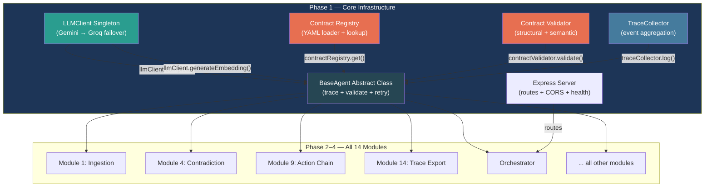

# Phase 1: Core Infrastructure — Implementation Plan

**Challenge 1 · Autonomous Content-to-Action Agent · AI Seekho 2026 Hackathon**
**Phase Duration:** 6–8 hours · **Evaluation Weight:** Antigravity Integration (20%) + Technical Foundation

---

## Goal

Build the **foundational plumbing** that all 14 pipeline modules will depend on. Phase 1 delivers four pillars:

1. **LLM Client singleton** wired for use by every agent (no direct SDK imports)
2. **AMCE Contract Enforcement Layer** — registry + validator + YAML definitions
3. **Antigravity Agent Framework** — `BaseAgent` abstract class with trace integration + retry logic
4. **Express API Server** with routes, health check, CORS, and contract loading

After Phase 1, any future module (Phase 2–4) can be implemented by simply extending `BaseAgent`, defining a YAML contract, and writing an `execute()` method — everything else (tracing, validation, retry, LLM routing) is automatic.

---

## How the 14-Module Architecture Depends on Phase 1



> [!IMPORTANT]
> Every module in Phases 2–4 extends `BaseAgent`. If Phase 1 is solid, building all 14 modules becomes mechanical: define contract YAML → implement `execute()` → done.

---

## Codebase Audit — Current Status of Phase 1 Components

| Step | Component | File | Status | Assessment |
|------|-----------|------|--------|------------|
| 0.6 | LLM Client | [llm-client.ts](file:///d:/Google%20Ai%20Seekho%202026/Autonomous%20Content-to-Action%20Agent/backend/src/utils/llm-client.ts) | ✅ Built | Multi-provider (Gemini/Groq/Vertex), env switching, lazy Groq init, embedding support. |
| 0.6 | LLM Client Test | [test-llm-client.ts](file:///d:/Google%20Ai%20Seekho%202026/Autonomous%20Content-to-Action%20Agent/backend/src/utils/test-llm-client.ts) | ✅ Built | Tests completion + embedding + Vertex skip. |
| 1.1 | LLM wiring verification | — | ⚠️ Needs smoke test | No dedicated smoke test exists confirming the singleton import pattern works from an agent file. |
| 1.2 | Contract Registry | [registry.ts](file:///d:/Google%20Ai%20Seekho%202026/Autonomous%20Content-to-Action%20Agent/backend/src/contracts/registry.ts) | ✅ Built | YAML loader, version pinning (`name@version`), `list()`, `get()`, `getRequired()`. |
| 1.2 | Contract Validator | [validator.ts](file:///d:/Google%20Ai%20Seekho%202026/Autonomous%20Content-to-Action%20Agent/backend/src/contracts/validator.ts) | ✅ Built | Structural (types, regex, enum, min/max, nested arrays) + semantic (LLM base-model check). |
| 1.2 | Contract YAMLs (3) | `definitions/` | ✅ Built | `multi_source_ingestion_v1`, `contradiction_detection_v1`, `action_chain_v1` — all with semantic_checks. |
| 1.2 | Contract test script | `test-validator.ts` | ❌ Missing | `package.json` has `test:contracts` script pointing to `src/contracts/test-validator.ts` but file doesn't exist. |
| 1.3 | Base Agent | [base.agent.ts](file:///d:/Google%20Ai%20Seekho%202026/Autonomous%20Content-to-Action%20Agent/backend/src/agents/base.agent.ts) | ✅ Built | Abstract `execute()`, contract validation loop (up to 2 retries), trace logging, `llmComplete()`, `llmEmbed()`, `logDecision()`. |
| 1.3 | Trace Collector | [collector.ts](file:///d:/Google%20Ai%20Seekho%202026/Autonomous%20Content-to-Action%20Agent/backend/src/tracing/collector.ts) | ✅ Built | `initPipeline()`, `log()`, `finalizePipeline()`, categorizes events into reasoning_steps/tool_calls/recovery_steps. |
| 1.4 | Express Server | [index.ts](file:///d:/Google%20Ai%20Seekho%202026/Autonomous%20Content-to-Action%20Agent/backend/src/index.ts) | ✅ Built | Health check, CORS, JSON body (50MB), contract loading on startup, route logging. |
| 1.4 | Pipeline Routes | [pipeline.routes.ts](file:///d:/Google%20Ai%20Seekho%202026/Autonomous%20Content-to-Action%20Agent/backend/src/routes/pipeline.routes.ts) | ⚠️ Stub | `POST /run` returns stub response. `GET /:id`, `GET /:id/trace`, `GET /contracts/list` exist. Missing: `GET /api/contracts` standalone route, `GET /api/validations` history. |
| — | Decision Gate | `contracts/decision-gate.ts` | ❌ Missing | Master prompt architecture lists this as separate module. Currently embedded in `BaseAgent.run()`. |
| — | Benchmark | `contracts/benchmark.ts` | ❌ Missing | Listed in master prompt architecture. Nice-to-have for Phase 1. |
| — | npm scripts | [package.json](file:///d:/Google%20Ai%20Seekho%202026/Autonomous%20Content-to-Action%20Agent/backend/package.json) | ✅ Built | `dev`, `build`, `test:llm`, `test:contracts`, `test:stress`, `test:contradiction` configured. |
| — | TypeScript config | [tsconfig.json](file:///d:/Google%20Ai%20Seekho%202026/Autonomous%20Content-to-Action%20Agent/backend/tsconfig.json) | ✅ Built | ES2020, strict, commonjs. |
| — | Environment files | `.env.development`, `.env.production` | ✅ Built | Keys configured with provider settings. |

---

## AMCE Contract Enforcement Layer — Architecture Deep-Dive

The Master Prompt specifies this flow for every module output:

```
Module Output ─►  Schema Validation (field presence, types, enums, ranges, regex)
              ─►  Semantic Validation (LLM base-model cross-check)
              ─►  Decision Gate: PASS / WARN / REJECT
                      │              │
                   PASS            REJECT
                      │              │
                 Proceed        Re-generate with base model
                                (up to 2 retries) or fallback
```

**What's already implemented:**
- **Structural validation** in [validator.ts](file:///d:/Google%20Ai%20Seekho%202026/Autonomous%20Content-to-Action%20Agent/backend/src/contracts/validator.ts): checks types, required fields, regex, enum, min/max, nested array objects
- **Semantic validation** via `validateSemantic()`: sends data + semantic_checks rules to LLM base model, parses PASS/FAIL per rule
- **Decision gate logic** in [base.agent.ts](file:///d:/Google%20Ai%20Seekho%202026/Autonomous%20Content-to-Action%20Agent/backend/src/agents/base.agent.ts) lines 44–80: loops up to `maxRetries`, logs contract_gate events to trace, triggers re-generation on REJECT

**What's missing for Phase 1 completeness:**
1. **`test-validator.ts`** — the contract validation test script (`npm run test:contracts` has no file to run)
2. **Decision Gate as standalone class** — currently embedded in `BaseAgent.run()`, should be extracted per master prompt architecture (`contracts/decision-gate.ts`)
3. **Contracts route** — the master prompt lists `GET /api/contracts` and `GET /api/validations` as dedicated routes
4. **Smoke test** for the LLM singleton wiring pattern

---

## Proposed Changes

### Step 1.1 — Wire LLM Client Verification

#### [NEW] `backend/src/utils/smoke-test-singleton.ts`
- Import `llmClient` from `../utils/llm-client`
- Call `llmClient.complete("Hello from smoke test")` — verify response
- Call `llmClient.generateEmbedding("test")` — verify 768-dim vector
- Call `llmClient.complete("Validate this", true)` — verify base model path
- Confirm no direct `@google/generative-ai` or `groq-sdk` imports in agent files
- Print ✅/❌ for each check

**Why:** Roadmap Step 1.1 requires confirming that the singleton pattern works from agent files. The existing `test-llm-client.ts` tests the class directly but doesn't validate the import-from-agent-file pattern.

---

### Step 1.2 — Contract Registry & Validator Completion

#### [NEW] `backend/src/contracts/decision-gate.ts`
- Extract the PASS/WARN/REJECT decision logic from `BaseAgent.run()` into a standalone `DecisionGate` class
- Methods: `evaluate(output, contract, inputContext?) → { action: 'PASS'|'WARN'|'REJECT', traceEvent, handleRejection() }`
- `handleRejection()` returns instructions for re-generation or fallback value
- This matches the master prompt's architecture diagram which shows `decision-gate.ts` as a separate file

```typescript
// Proposed interface
export interface GateResult {
    action: "PASS" | "WARN" | "REJECT";
    errors: string[];
    warnings: string[];
    semantic_issues: string[];
    traceEvent: Omit<TraceEvent, "event_id" | "timestamp">;
}

export class DecisionGate {
    async evaluate(
        output: unknown,
        contract: Contract,
        context?: string
    ): Promise<GateResult>;
}
```

#### [NEW] `backend/src/contracts/test-validator.ts`
- Test 1: Valid data against `multi_source_ingestion_v1` → expect PASS
- Test 2: Missing required field → expect REJECT with error message
- Test 3: Invalid enum value (source_type = "invalid") → expect REJECT
- Test 4: Regex mismatch (ingestion_id = "BAD-FORMAT") → expect REJECT
- Test 5: Valid data against `contradiction_detection_v1` → expect PASS
- Test 6: Valid data against `action_chain_v1` → expect PASS
- Test 7: action_count = 6 (exceeds max:5) → expect WARN
- Print summary: X/7 tests passed

**Why:** `package.json` already has `npm run test:contracts` pointing to this file, but it doesn't exist yet.

#### [MODIFY] `backend/src/agents/base.agent.ts`
- Refactor the contract validation loop (lines 44–80) to use the new `DecisionGate` class instead of inline logic
- Keep the same behavior: evaluate → log → retry on REJECT
- This makes `BaseAgent` thinner and `DecisionGate` reusable by the orchestrator in Phase 4

---

### Step 1.3 — Antigravity Agent Framework Hardening

> [!NOTE]
> `BaseAgent` and `TraceCollector` are already functional. This step focuses on ensuring they fully match the master prompt requirements.

#### [MODIFY] `backend/src/agents/base.agent.ts`
- Add `use_base_model_on_retry` flag: when contract REJECTs, retry with `useBaseModel=true` passed to `execute()` (the retry hint is already logged in trace but not actually forwarded to the child agent's execute method)
- Add `agent_version` field to trace events for versioning
- Add `execution_duration_ms` to `agent_complete` trace event (total wall time for the agent)

#### [MODIFY] `backend/src/tracing/collector.ts`
- No structural changes needed — already handles all required event types
- Add `getAll(): PipelineTrace[]` method for the `GET /api/validations` route to list all pipeline traces

---

### Step 1.4 — Express API Server Completion

#### [NEW] `backend/src/routes/contracts.routes.ts`
- `GET /api/contracts` — list all loaded contracts with name, version, module, field count
- `GET /api/contracts/:name` — get full contract definition by name
- `GET /api/validations` — list all pipeline traces (from TraceCollector) showing contract gate decisions

#### [MODIFY] `backend/src/index.ts`
- Mount `contractsRoutes` at `/api/contracts`
- Mount validations under `/api/validations`

#### [MODIFY] `backend/src/routes/pipeline.routes.ts`
- Remove the `GET /contracts/list` endpoint (moving to dedicated contracts route)
- Keep `POST /run`, `GET /:id`, `GET /:id/trace` as-is (orchestrator integration in Phase 4)

#### [MODIFY] `backend/package.json`
- Add `"test:smoke"` script: `"cross-env APP_ENV=development npx ts-node src/utils/smoke-test-singleton.ts"`

---

## Open Questions

1. **Decision Gate extraction priority:** Should we extract `DecisionGate` into its own class now (cleaner architecture, matches master prompt) or leave the logic inline in `BaseAgent.run()` to save time and extract later in Phase 4 when the orchestrator needs it?

2. **Semantic validation in tests:** The `test-validator.ts` tests — should they include semantic validation tests (which require live LLM calls and will burn API quota) or only test structural validation for now?

3. **Validation history persistence:** The master prompt lists `GET /api/validations`. Should we store validation history in SQLite (`better-sqlite3` is already installed) or keep it in-memory via `TraceCollector` for the hackathon?

---

## Verification Plan

### Automated Tests

```bash
# Step 1.1 — LLM singleton wiring
APP_ENV=development npm run test:smoke
# Expected: ✅ llmClient.complete() works
#           ✅ llmClient.generateEmbedding() returns 768-dim vector
#           ✅ Base model path works

# Step 1.2 — Contract validation
APP_ENV=development npm run test:contracts
# Expected: 7/7 tests passed (structural validation)

# Step 1.4 — Server startup + health check
APP_ENV=development npm run dev
# Then:
curl http://localhost:8000/health
# Expected: { status: "ok", environment: "development", provider: "gemini-free", contracts_loaded: [...] }

curl http://localhost:8000/api/contracts
# Expected: list of 3 contracts with metadata

curl -X POST http://localhost:8000/api/pipeline/run \
  -H "Content-Type: application/json" \
  -d '{"sources": [{"type":"test"}]}'
# Expected: { pipeline_id: "PIPE-...", status: "received" }
```

### Phase 1 Complete Checklist (from Roadmap)

- [ ] All agents import `llmClient` singleton — no direct SDK imports in agent files
- [ ] LLM client working with Gemini free tier and Groq fallback
- [ ] Contract registry loading YAML definitions
- [ ] Validator passing all structural tests
- [ ] Base agent framework with trace logging
- [ ] Express server running and responding
