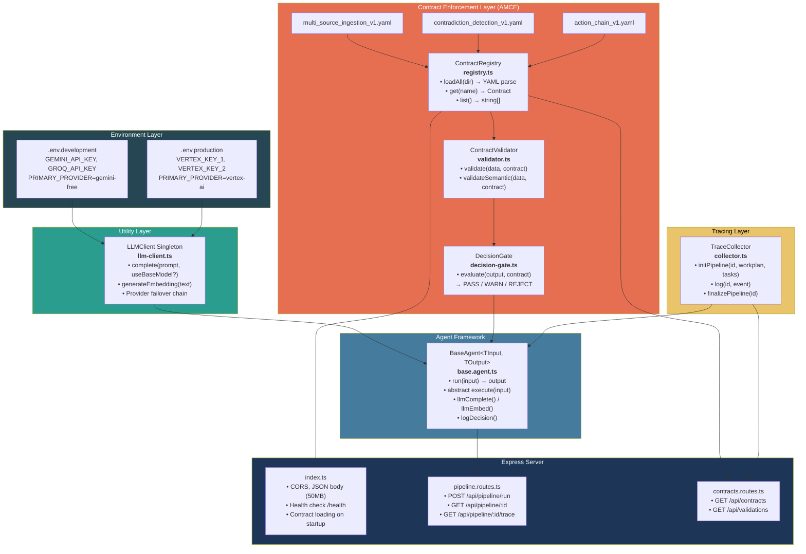
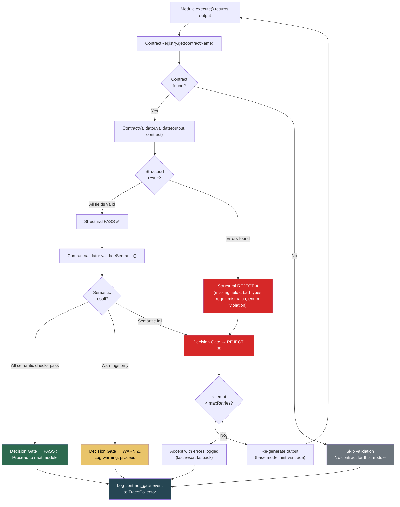
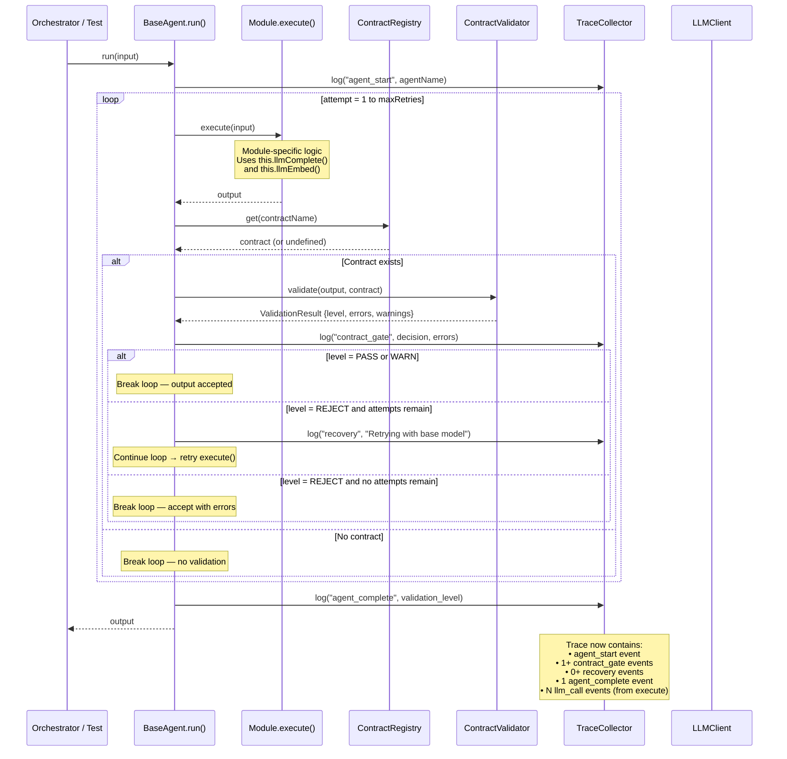
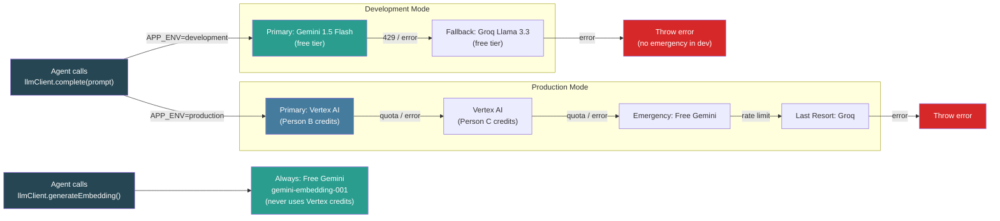

# Phase 1 Workflow Diagrams — Core Infrastructure

**Challenge 1 · Autonomous Content-to-Action Agent · AI Seekho 2026 Hackathon**

---

## 1. Phase 1 Component Dependency Graph

Shows how the 6 core components interconnect. Every future module (Phase 2–4) plugs into `BaseAgent` and inherits all infrastructure automatically.



---

## 2. AMCE Contract Enforcement — Decision Flow

This flow runs **after every module's `execute()` call**. It's the core of the AMCE-inspired layer from the master prompt.



---

## 3. BaseAgent Execution Lifecycle

Sequence diagram showing exactly what happens when a module's `run()` is called.



---

## 4. LLM Call Routing Flow

Shows how every `llmClient.complete()` call routes through the provider failover chain.



---

## 5. Phase 1 File Map — Status

```
backend/src/
├── utils/
│   ├── llm-client.ts              ✅ LLMClient singleton (Gemini → Groq → Vertex)
│   ├── test-llm-client.ts         ✅ Environment test (dev/prod)
│   └── smoke-test-singleton.ts    ❌ NEW — Singleton import pattern smoke test
│
├── contracts/
│   ├── registry.ts                ✅ YAML loader, get(), getRequired(), list()
│   ├── validator.ts               ✅ Structural + semantic validation
│   ├── decision-gate.ts           ❌ NEW — Standalone PASS/WARN/REJECT gate
│   ├── test-validator.ts          ❌ NEW — 7 structural validation tests
│   └── definitions/
│       ├── multi_source_ingestion_v1.yaml   ✅ 
│       ├── contradiction_detection_v1.yaml  ✅ 
│       └── action_chain_v1.yaml             ✅ 
│
├── agents/
│   └── base.agent.ts              ✅ Abstract BaseAgent with trace + contract loop
│                                   ⚠️ MODIFY — refactor to use DecisionGate
│
├── tracing/
│   └── collector.ts               ✅ TraceCollector (events, reasoning, tools, recovery)
│                                   ⚠️ MODIFY — add getAll() method
│
├── routes/
│   ├── pipeline.routes.ts         ⚠️ STUB — POST /run returns stub, GET routes work
│   └── contracts.routes.ts        ❌ NEW — GET /api/contracts, GET /api/validations
│
└── index.ts                       ✅ Express server, health check, CORS, contract loading
                                   ⚠️ MODIFY — mount new contracts route
```

**Legend:** ✅ Complete · ⚠️ Needs modification · ❌ Needs creation
