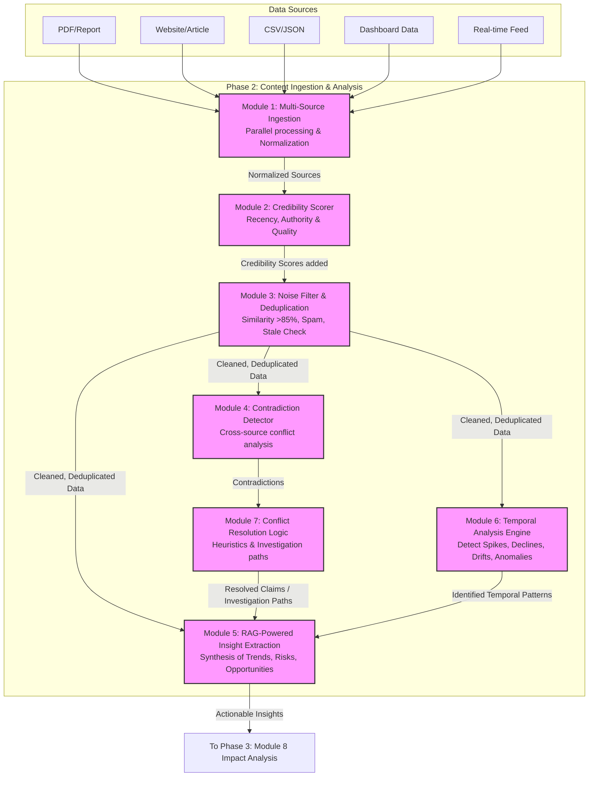

# Phase 2 Workflow Diagram

The following Mermaid diagram illustrates the flow of data across Modules 1 through 7 during Phase 2: Content Ingestion & Analysis.

```mermaid
flowchart TD
    subgraph Data Sources
        A1[PDF/Report]
        A2[Website/Article]
        A3[CSV/JSON]
        A4[Dashboard Data]
        A5[Real-time Feed]
    end

    subgraph Phase 2: Content Ingestion & Analysis
        Ingestion[Module 1: Multi-Source Ingestion<br>Parallel processing & Normalization]
        CredScorer[Module 2: Credibility Scorer<br>Recency, Authority & Quality]
        NoiseFilter[Module 3: Noise Filter & Deduplication<br>Similarity >85%, Spam, Stale Check]
        Contradiction[Module 4: Contradiction Detector<br>Cross-source conflict analysis]
        Resolution[Module 7: Conflict Resolution Logic<br>Heuristics & Investigation paths]
        Temporal[Module 6: Temporal Analysis Engine<br>Detect Spikes, Declines, Drifts, Anomalies]
        RAG[Module 5: RAG-Powered Insight Extraction<br>Synthesis of Trends, Risks, Opportunities]
    end

    %% Flow logic
    A1 --> Ingestion
    A2 --> Ingestion
    A3 --> Ingestion
    A4 --> Ingestion
    A5 --> Ingestion

    Ingestion -->|Normalized Sources| CredScorer
    CredScorer -->|Credibility Scores added| NoiseFilter
    NoiseFilter -->|Cleaned, Deduplicated Data| Contradiction
    NoiseFilter -->|Cleaned, Deduplicated Data| Temporal
    NoiseFilter -->|Cleaned, Deduplicated Data| RAG
    
    Contradiction -->|Contradictions| Resolution
    Resolution -->|Resolved Claims / Investigation Paths| RAG
    Temporal -->|Identified Temporal Patterns| RAG

    %% Outputs going to Phase 3
    RAG -->|Actionable Insights| Output[To Phase 3: Module 8 Impact Analysis]

    classDef module fill:#f9f,stroke:#333,stroke-width:2px;
    class Ingestion,CredScorer,NoiseFilter,Contradiction,Resolution,Temporal,RAG module;
```
