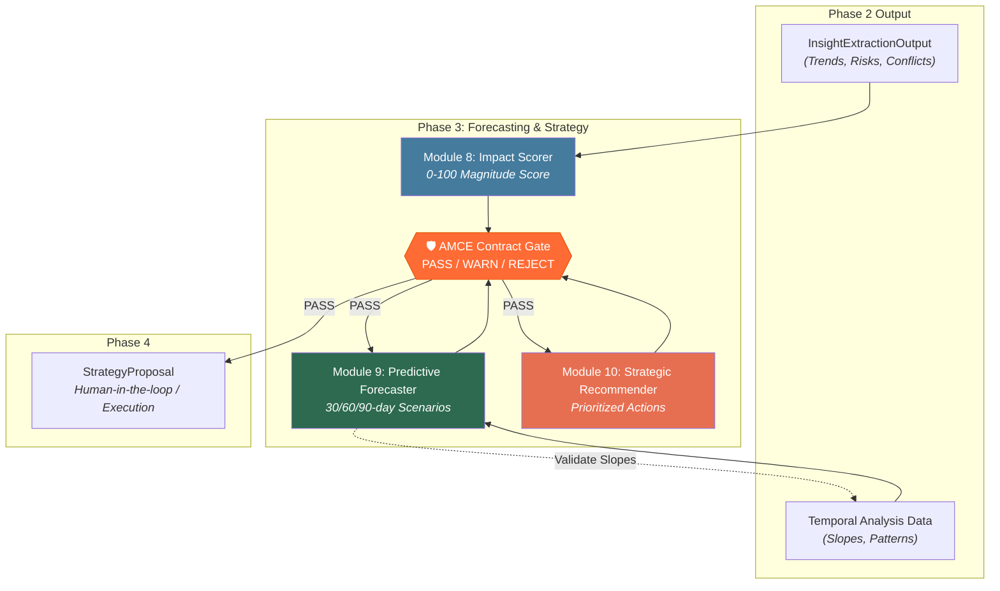

# Workflow Diagram — Phase 3: Impact Analysis & Strategic Forecasting

## Internal Logic & Data Flow

```mermaid
flowchart TD
    subgraph PHASE2["Phase 2 Output"]
        M5_Out["InsightExtractionOutput<br/><i>(Trends, Risks, Conflicts)</i>"]
        M6_Out["Temporal Analysis Data<br/><i>(Slopes, Patterns)</i>"]
    end

    subgraph PHASE3["Phase 3: Forecasting & Strategy"]
        M8["Module 8: Impact Scorer<br/><i>0-100 Magnitude Score</i>"]
        M9["Module 9: Predictive Forecaster<br/><i>30/60/90-day Scenarios</i>"]
        M10["Module 10: Strategic Recommender<br/><i>Prioritized Actions</i>"]
        
        AMCE{{"🛡️ AMCE Contract Gate<br/>PASS / WARN / REJECT"}}
    end

    subgraph PHASE4["Phase 4"]
        P4_Out["StrategyProposal<br/><i>Human-in-the-loop / Execution</i>"]
    end

    M5_Out --> M8
    M8 --> AMCE
    AMCE -- "PASS" --> M9
    
    %% Temporal Feedback Loop
    M6_Out --> M9
    M9 -. "Validate Slopes" .-> M6_Out
    
    M9 --> AMCE
    AMCE -- "PASS" --> M10
    
    M10 --> AMCE
    AMCE -- "PASS" --> P4_Out
    
    style AMCE fill:#ff6b35,color:#fff,stroke:#e55100
    style M8 fill:#457b9d,color:#fff
    style M9 fill:#2d6a4f,color:#fff
    style M10 fill:#e76f51,color:#fff
```
