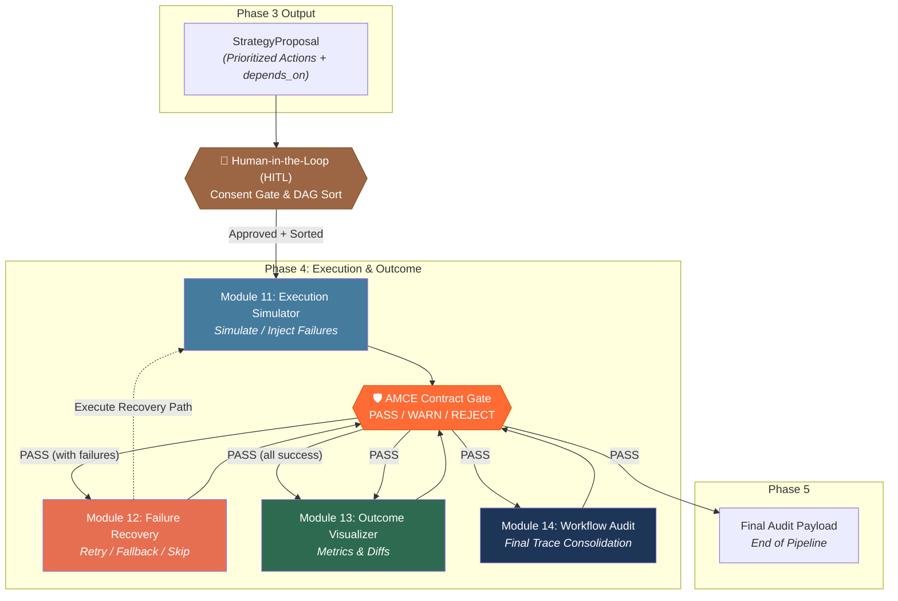

# Workflow Diagram — Phase 4: Execution & Outcome

```mermaid
flowchart TD
    subgraph PHASE3["Phase 3 Output"]
        M10_Out["StrategyProposal<br/><i>(Prioritized Actions + depends_on)</i>"]
    end

    HITL{{"👤 Human-in-the-Loop (HITL)<br/>Consent Gate & DAG Sort"}}

    subgraph PHASE4["Phase 4: Execution & Outcome"]
        M11["Module 11: Execution Simulator<br/><i>Simulate / Inject Failures</i>"]
        M12["Module 12: Failure Recovery<br/><i>Retry / Fallback / Skip</i>"]
        M13["Module 13: Outcome Visualizer<br/><i>Metrics & Diffs</i>"]
        M14["Module 14: Workflow Audit<br/><i>Final Trace Consolidation</i>"]
        
        AMCE{{"🛡️ AMCE Contract Gate<br/>PASS / WARN / REJECT"}}
    end

    subgraph PHASE5["Phase 5"]
        Terminal["Final Audit Payload<br/><i>End of Pipeline</i>"]
    end

    M10_Out --> HITL
    HITL -- "Approved + Sorted" --> M11
    
    M11 --> AMCE
    AMCE -- "PASS (with failures)" --> M12
    AMCE -- "PASS (all success)" --> M13
    
    %% Feedback Loop for Recovery
    M12 -. "Execute Recovery Path" .-> M11
    
    M12 --> AMCE
    AMCE -- "PASS" --> M13
    
    M13 --> AMCE
    AMCE -- "PASS" --> M14
    
    M14 --> AMCE
    AMCE -- "PASS" --> Terminal
    
    style HITL fill:#9c6644,color:#fff,stroke:#7f4f24
    style AMCE fill:#ff6b35,color:#fff,stroke:#e55100
    style M11 fill:#457b9d,color:#fff
    style M12 fill:#e76f51,color:#fff
    style M13 fill:#2d6a4f,color:#fff
    style M14 fill:#1d3557,color:#fff
```