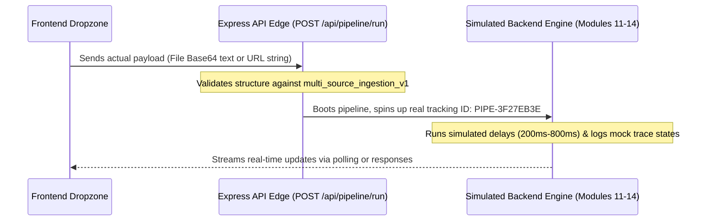

```mermaid
sequenceDiagram
    participant FE as Frontend Dropzone
    participant API as Express API Edge (POST /api/pipeline/run)
    participant Agent as Simulated Backend Engine (Modules 11-14)
    
    FE->>API: Sends actual payload (File Base64 text or URL string)
    Note over API: Validates structure against multi_source_ingestion_v1
    API->>Agent: Boots pipeline, spins up real tracking ID: PIPE-3F27EB3E
    Note over Agent: Runs simulated delays (200ms-800ms) & logs mock trace states
    Agent-->>FE: Streams real-time updates via polling or responses
```