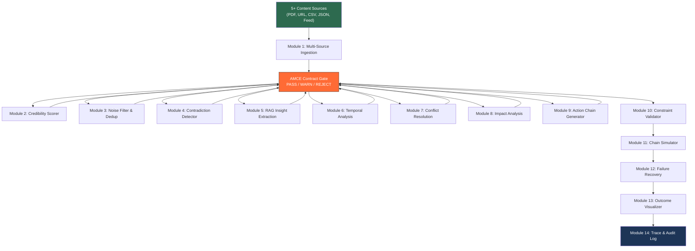

# Autonomous Content-to-Action Agent — Implementation Plan

**Challenge 1 · AI Seekho 2026 Hackathon · Deadline: May 20, 2026**

---

## Background & Context

We are building a **production-grade agentic AI system** that ingests 5+ content sources simultaneously, detects contradictions, performs temporal analysis, generates 3–5 interconnected action chains, simulates execution with constraint validation, and handles failure recovery — all governed by an **AMCE-inspired contract enforcement layer**.

> [!IMPORTANT]
> **Hard Deadline:** May 20, 2026. Today is **May 15** — we have **5 days** remaining.
> Per the roadmap schedule, we should be entering **Phase 3** (Modules 8–13: Action Chain & Simulation).

---

## Codebase Status Audit

### ✅ Already Implemented (Phase 0 + Phase 1 — Core Infrastructure)

| Component | File | Status |
|-----------|------|--------|
| LLM Client (multi-provider, env switching) | [llm-client.ts](file:///d:/Google%20Ai%20Seekho%202026/Autonomous%20Content-to-Action%20Agent/backend/src/utils/llm-client.ts) | ✅ Complete |
| LLM Client Test | [test-llm-client.ts](file:///d:/Google%20Ai%20Seekho%202026/Autonomous%20Content-to-Action%20Agent/backend/src/utils/test-llm-client.ts) | ✅ Complete |
| Base Agent Framework (trace + contract integration) | [base.agent.ts](file:///d:/Google%20Ai%20Seekho%202026/Autonomous%20Content-to-Action%20Agent/backend/src/agents/base.agent.ts) | ✅ Complete |
| Contract Registry (YAML loader) | [registry.ts](file:///d:/Google%20Ai%20Seekho%202026/Autonomous%20Content-to-Action%20Agent/backend/src/contracts/registry.ts) | ✅ Complete |
| Contract Validator (structural + semantic) | [validator.ts](file:///d:/Google%20Ai%20Seekho%202026/Autonomous%20Content-to-Action%20Agent/backend/src/contracts/validator.ts) | ✅ Complete |
| Contract Definitions (3 YAML) | `definitions/` — `multi_source_ingestion_v1`, `contradiction_detection_v1`, `action_chain_v1` | ✅ Complete |
| Trace Collector | [collector.ts](file:///d:/Google%20Ai%20Seekho%202026/Autonomous%20Content-to-Action%20Agent/backend/src/tracing/collector.ts) | ✅ Complete |
| Express Server + Health Check | [index.ts](file:///d:/Google%20Ai%20Seekho%202026/Autonomous%20Content-to-Action%20Agent/backend/src/index.ts) | ✅ Complete |
| Pipeline Route (stub) | [pipeline.routes.ts](file:///d:/Google%20Ai%20Seekho%202026/Autonomous%20Content-to-Action%20Agent/backend/src/routes/pipeline.routes.ts) | ✅ Stub |
| Environment files | `.env.development`, `.env.production` | ✅ Complete |

### ❌ Not Yet Implemented

| Component | Target File | Phase |
|-----------|-------------|-------|
| **Module 1:** Multi-Source Ingestion Agent | `agents/multi-source-ingestion.agent.ts` | Phase 2 |
| **Module 2:** Credibility Scorer Agent | `agents/credibility-scorer.agent.ts` | Phase 2 |
| **Module 3:** Noise Filter & Deduplication Agent | `agents/noise-filter.agent.ts` | Phase 2 |
| **Module 4:** Contradiction Detector Agent | `agents/contradiction-detector.agent.ts` | Phase 2 |
| **Module 5:** RAG-Powered Insight Extraction Agent | `agents/insight-extraction.agent.ts` | Phase 2 |
| **Module 6:** Temporal Analysis Engine Agent | `agents/temporal-analysis.agent.ts` | Phase 2 |
| **Module 7:** Conflict Resolution Agent | `agents/conflict-resolution.agent.ts` | Phase 2 |
| **Module 8:** Impact Analysis Agent | `agents/impact-analysis.agent.ts` | Phase 3 |
| **Module 9:** Action Chain Generator Agent | `agents/action-chain-generator.agent.ts` | Phase 3 |
| **Module 10:** Constraint Validator | `simulation/constraint-validator.ts` | Phase 3 |
| **Module 11:** Action Chain Simulator | `simulation/chain-simulator.ts` | Phase 3 |
| **Module 12:** Failure Recovery Engine | `simulation/failure-recovery.ts` | Phase 3 |
| **Module 13:** Outcome Visualizer | `simulation/outcome-visualizer.ts` | Phase 3 |
| **Module 14:** Trace Exporter (Audit Log) | `tracing/exporter.ts` | Phase 4 |
| Pipeline Orchestrator | `agents/orchestrator.ts` | Phase 4 |
| Pipeline Routes (full impl) | `routes/pipeline.routes.ts` | Phase 4 |
| Contract Routes | `routes/contracts.routes.ts` | Phase 4 |
| Utility: Cosine Similarity | `utils/cosine-similarity.ts` | Phase 2 |
| Utility: Embedding Helper | `utils/embedding.ts` | Phase 2 |
| Test Data | `backend/test-data/` (5 source files) | Phase 2 |
| Demo Data | `backend/demo-data/` (inventory scenario) | Phase 6 |
| React Web Dashboard | `frontend/src/` | Phase 5 |
| React Native Mobile App | `mobile/` | Phase 5 |
| Stress Tests (5 scenarios) | `backend/test/stress-tests.ts` | Phase 6 |
| README.md | project root | Phase 7 |

---

## 14-Module Architecture Reference



---

## AMCE Contract Enforcement Layer

Every module output passes through the contract gate before the next module runs:

```
Module Output → Structural Validation (schema, types, enums, ranges)
             → Semantic Validation (LLM base-model check)
             → Decision Gate: PASS → proceed
                              WARN → proceed + log warning
                              REJECT → re-generate with base model (up to 2 retries)
                                       or use fallback value
```

**Already implemented:**
- `ContractValidator.validate()` — structural checks (types, regex, enum, min/max)
- `ContractValidator.validateSemantic()` — LLM-powered semantic checks via base model
- `BaseAgent.run()` — orchestrates execute → validate → retry loop with trace logging
- 3 YAML contract definitions loaded at server startup

**Still needed:**
- Additional contract YAML definitions for Modules 5–13
- Decision gate as standalone component (currently embedded in `BaseAgent`)
- Benchmark module for A/B comparison (nice-to-have)

---

## Proposed Changes — Phase by Phase

### Phase 2: Content Ingestion & Analysis (Modules 1–7)

> [!IMPORTANT]
> This phase implements the **analysis backbone** — worth 40% of the score (Agentic Reasoning 20% + Insight Quality 20%).

---

#### [NEW] `backend/src/utils/cosine-similarity.ts`
- Pure math utility for cosine similarity between two number[] vectors
- Used by Noise Filter (Module 3) for deduplication

#### [NEW] `backend/src/utils/embedding.ts`
- Thin wrapper around `llmClient.generateEmbedding()` for batch embedding generation

---

#### [NEW] `backend/src/agents/multi-source-ingestion.agent.ts` — Module 1
- Extends `BaseAgent`
- Parallel ingestion via `Promise.all` for 5+ sources
- Content parsers: `pdf-parse` (PDF), `cheerio` (URL), `papaparse` (CSV), `JSON.parse` (JSON), `EventEmitter` mock (real-time feed)
- Output: `NormalizedSource[]` with `source_id`, `source_type`, `raw_text`, `structured_data`, `extraction_confidence`, `timestamp`, `word_count`
- Validates against `multi_source_ingestion_v1` contract

#### [NEW] `backend/src/agents/credibility-scorer.agent.ts` — Module 2
- Recency scoring: 0–40 pts (hour/day/week/month/older)
- Authority scoring: 0–30 pts (government → anonymous)
- Quality scoring: 0–30 pts via LLM analysis (citations, numerical data, structure)
- Output: `CredibilityScore[]` with tier classification: HIGH ≥70, MEDIUM ≥40, LOW ≥20, UNVERIFIED <20

#### [NEW] `backend/src/agents/noise-filter.agent.ts` — Module 3
- Staleness filter (recency_score === 0 → remove)
- Deduplication via embedding cosine similarity (>85% → keep highest credibility)
- Spam detection (excessive special chars, promotional language)
- Output: `FilteredSources { kept_sources, removed_sources[] }`

#### [NEW] `backend/src/agents/contradiction-detector.agent.ts` — Module 4
- LLM-powered claim extraction from each source
- Topic grouping of claims
- Pairwise conflict detection: numeric (>20% diff), boolean (opposite), categorical, temporal
- Severity scoring: CRITICAL / HIGH / MEDIUM / LOW
- Validates against `contradiction_detection_v1` contract

#### [NEW] `backend/src/agents/insight-extraction.agent.ts` — Module 5
- In-memory vector store (simple array of embeddings)
- Content chunking: 500 tokens, 100 token overlap
- RAG retrieval: top-5 relevant chunks via cosine similarity
- LLM insight generation: 3–7 insights (trends, risks, opportunities, contradictions)
- Flags `REQUIRES_RESOLUTION` for contradictory insights

#### [NEW] `backend/src/agents/temporal-analysis.agent.ts` — Module 6
- Linear regression on time-series data points
- Pattern detection: decline, spike (>2σ), drift, anomaly, stable
- R² confidence scoring
- LLM-generated natural language explanation

#### [NEW] `backend/src/agents/conflict-resolution.agent.ts` — Module 7
- Strategy selection: trust_credible (Δ>30pts), trust_recent (Δ>24h), request_clarification, aggregate, human_review
- Investigation actions generator
- Never forces false conclusions — always generates an investigation path

#### [NEW] `backend/src/contracts/definitions/` — Additional contracts
- `credibility_scoring_v1.yaml`
- `noise_filter_v1.yaml`
- `insight_extraction_v1.yaml`
- `temporal_analysis_v1.yaml`
- `conflict_resolution_v1.yaml`
- `impact_analysis_v1.yaml`
- `constraint_validation_v1.yaml`
- `outcome_visualization_v1.yaml`

#### [NEW] `backend/test-data/` — 5 test source files
- `sample-report.pdf` (or `.txt` simulating PDF content)
- `sample-data.csv` (sales dashboard)
- `sample-email.txt` (supplier notification)
- `urls.json` (news article URLs)
- `realtime-feed.json` (customer complaints)

---

### Phase 3: Action Chain & Simulation (Modules 8–13)

> [!IMPORTANT]
> Worth 30% of score (Action Chain Simulation 15% + Robustness 15%)

#### [NEW] `backend/src/agents/impact-analysis.agent.ts` — Module 8
- Constraint-aware impact analysis: budget, time, resource, urgency
- Output: `ImpactAnalysis` with quantified_impact, constraints_violated, cascading_effects, risk_if_ignored

#### [NEW] `backend/src/agents/action-chain-generator.agent.ts` — Module 9
- LLM-generated 3–5 interconnected actions
- Action types: diagnose, notify, update_system, mitigate, monitor, verify, escalate
- Dependency graph: `depends_on[]`, `blocks[]`
- Per-action constraints, simulation config, failure recovery config
- Validates against `action_chain_v1` contract

#### [NEW] `backend/src/simulation/constraint-validator.ts` — Module 10
- Budget check: action.max_cost > budget_limit → BLOCKING
- Time check: action.max_duration > time_limit → BLOCKING
- Resource check: action.api_rate_limit > resource_limit → WARNING
- Output: `ConstraintValidationResult[]` with recommended_modification

#### [NEW] `backend/src/simulation/chain-simulator.ts` — Module 11
- Sequential execution following `execution_order`
- Dependency checking before each action
- State tracking: `SimulationState { state_id, timestamp, variables }`
- Failure injection: `Math.random() > expected_success_rate` when `simulateFailures=true`
- Before/after state snapshots per action

#### [NEW] `backend/src/simulation/failure-recovery.ts` — Module 12
- Recovery strategies: retry → fallback → rollback → skip_and_continue
- Retry with decrementing retry_count
- Fallback action substitution
- State rollback to previous snapshot
- Full recovery logging

#### [NEW] `backend/src/simulation/outcome-visualizer.ts` — Module 13
- State diff computation: added/removed/modified/unchanged variables
- Action execution timeline with status, cost, duration
- Aggregate metrics: total_cost, total_duration, success_rate, failures_recovered
- Projected impact: risk_reduction, estimated_value, affected_entities

---

### Phase 4: Pipeline Orchestrator & API (Day 4 — May 16)

#### [NEW] `backend/src/agents/orchestrator.ts`
- Sequential execution of all 14 modules with contract gates between each
- Trace event logging at every step
- Contract violation handling: re-generate or use fallback
- Returns complete `PipelineResult` with insights, contradictions, action_chain, simulation_results, outcome, trace

#### [NEW] `backend/src/tracing/exporter.ts` — Module 14
- Formats trace into judge-expected JSON structure
- Fields: `pipeline_id`, `environment`, `ai_provider_used`, `workplan`, `task_plan`, `reasoning_steps`, `tool_calls`, `action_execution`, `recovery_steps`

#### [MODIFY] `backend/src/routes/pipeline.routes.ts`
- Full implementation of `POST /api/pipeline/run` with Zod request validation
- `GET /api/pipeline/:id` for result retrieval
- `GET /api/pipeline/:id/trace` for trace logs

#### [NEW] `backend/src/routes/contracts.routes.ts`
- `GET /api/contracts` — list all loaded contracts

---

### Phase 5: Frontend & Mobile (Day 5 — May 17)

#### [NEW] React Web Dashboard (`frontend/`)
Components:
1. `InputPanel` — 5 file upload fields + constraint inputs + "Run Pipeline" button
2. `PipelineProgress` — real-time progress bar (module status: ⏳ → ✓ / ⚠️ / ✗)
3. `ContradictionViewer` — conflicting sources side-by-side with credibility + resolution
4. `ActionChainViewer` — dependency graph with connected nodes + constraint badges
5. `SimulationResults` — before/after state table + timeline + metrics
6. `TraceViewer` — expandable tree of Antigravity trace (workplan, reasoning, tools, recovery)

#### [NEW] React Native Mobile App (`mobile/`)
Screens:
1. `HomeScreen` — input form + recent runs
2. `ResultsScreen` — scrollable cards (insights, contradictions, action chain, simulation)
3. `TraceScreen` — simplified trace view

---

### Phase 6: Production Switch & Stress Tests (Day 6 — May 18)

- Cloud Run deployment (Person A's GCP credits)
- Vertex AI key configuration + production switch test
- 5 stress test scenarios implementation and execution (in dev mode)
- Demo scenario data files

### Phase 7: Documentation & Demo Video (Day 7 — May 19–20)

- `README.md` — architecture, data sources, tools, environment strategy, cost/latency, baseline
- Demo video (3–5 min) in production mode (Vertex AI)

---

## User Review Required

> [!WARNING]
> **Schedule Gap:** Per the roadmap, Phase 2 (Modules 1–7) was scheduled for Day 2 (May 14). We're now on Day 3 (May 15). The immediate priority should be completing Phase 2 ASAP and progressing into Phase 3 today.

> [!IMPORTANT]
> **Decision: Phase 2 vs Phase 3 Priority.** Since Phase 2 modules (contradiction detection, insight extraction) carry **40% of the evaluation weight** versus Phase 3's 30%, I recommend completing Phase 2 first even if it delays Phase 3 by half a day.

---

## Open Questions

1. **PDF Handling:** Should we use actual PDF parsing (`pdf-parse`) or accept plain-text files simulating PDF content for the hackathon prototype? The latter is faster to implement and avoids binary file handling in the API.

2. **Frontend Framework:** The roadmap suggests `create-react-app` with Tailwind CSS. Given CRA is deprecated, should we use **Vite + React** instead? This is faster to set up and produces better builds.

3. **Mobile Priority:** The roadmap marks React Native as MANDATORY. Given the tight timeline, should we implement a **minimal mobile app** (just results display) and invest more time in the web dashboard and backend robustness?

4. **Stress Test Scope:** Should we implement all 5 stress tests before the demo, or focus on the 3 most impactful ones (conflicting values, action failure & retry, constraint violation)?

---

## Verification Plan

### Automated Tests
```bash
# Phase 2 verification
APP_ENV=development npx ts-node src/agents/test-multi-source-ingestion.ts
APP_ENV=development npx ts-node src/agents/test-contradiction-detector.ts

# Phase 3 verification
APP_ENV=development npx ts-node src/simulation/test-chain-simulator.ts

# Phase 4 verification — full pipeline
APP_ENV=development curl -X POST http://localhost:8000/api/pipeline/run \
  -H "Content-Type: application/json" \
  -d @test-data/inventory-shortage-scenario.json

# Phase 6 — stress tests
APP_ENV=development npm run test:stress
```

### Manual Verification
- Frontend: visual inspection of all 6 dashboard components rendering pipeline results
- Mobile: Android emulator test of all 3 screens
- Demo: full end-to-end recording in production mode showing Vertex AI provider in trace
- Contract gates: verify PASS/WARN/REJECT decisions appear in trace for every module
