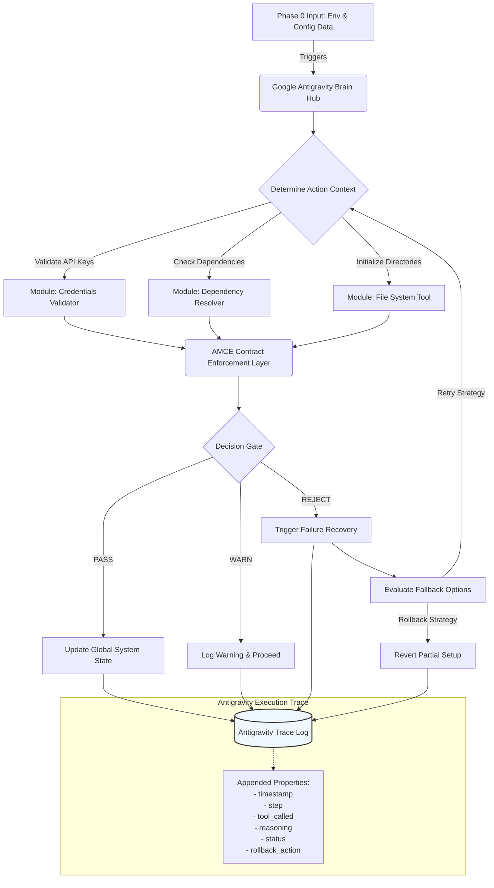

# Workflow Diagram: Phase 0 Orchestration

```mermaid
graph TD
    %% Core Orchestration
    A[Phase 0 Input: Env & Config Data] -->|Triggers| B(Google Antigravity Brain Hub)
    
    %% Execution Loop
    B --> C{Determine Action Context}
    C -->|Validate API Keys| D[Module: Credentials Validator]
    C -->|Check Dependencies| E[Module: Dependency Resolver]
    C -->|Initialize Directories| F[Module: File System Tool]
    
    %% Output to AMCE Layer
    D --> G(AMCE Contract Enforcement Layer)
    E --> G
    F --> G
    
    %% Decision Gate
    G --> H{Decision Gate}
    H -->|PASS| I[Update Global System State]
    H -->|WARN| J[Log Warning & Proceed]
    H -->|REJECT| K[Trigger Failure Recovery]
    
    %% Rollback & Recovery
    K --> L[Evaluate Fallback Options]
    L -->|Retry Strategy| C
    L -->|Rollback Strategy| M[Revert Partial Setup]
    
    %% Tracing and Logging
    I --> N[(Antigravity Trace Log)]
    J --> N
    K --> N
    M --> N
    
    %% Detailed Log Properties Note
    classDef logger fill:#f0f8ff,stroke:#333,stroke-width:2px;
    class N logger;
    
    subgraph Antigravity Execution Trace
        N
        O[Appended Properties:<br/>- timestamp<br/>- step<br/>- tool_called<br/>- reasoning<br/>- status<br/>- rollback_action]
        N -.-> O
    end
```
