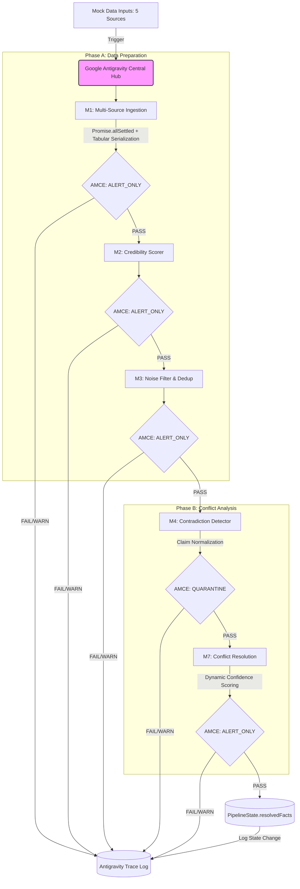

# Workflow Diagram: Phase 1 Orchestration (M1-M4, M7)

```mermaid
graph TD
    %% Core Orchestration
    A[Mock Data Inputs: 5 Sources] -->|Trigger| B(Google Antigravity Central Hub)
    
    %% Phase A: Data Preparation
    subgraph Phase A: Data Preparation
        B --> C[M1: Multi-Source Ingestion]
        C -->|Promise.allSettled + Tabular Serialization| AMCE1{AMCE: ALERT_ONLY}
        AMCE1 -->|PASS| D[M2: Credibility Scorer]
        D --> AMCE2{AMCE: ALERT_ONLY}
        AMCE2 -->|PASS| E[M3: Noise Filter & Dedup]
        E --> AMCE3{AMCE: ALERT_ONLY}
    end

    %% Phase B: Conflict Analysis
    subgraph Phase B: Conflict Analysis
        AMCE3 -->|PASS| F[M4: Contradiction Detector]
        F -->|Claim Normalization| AMCE4{AMCE: QUARANTINE}
        AMCE4 -->|PASS| G[M7: Conflict Resolution]
        G -->|Dynamic Confidence Scoring| AMCE7{AMCE: ALERT_ONLY}
    end

    %% State Mutation and Tracing
    AMCE7 -->|PASS| H[(PipelineState.resolvedFacts)]
    
    %% Failure & Tracing
    AMCE1 -->|FAIL/WARN| Trace[(Antigravity Trace Log)]
    AMCE2 -->|FAIL/WARN| Trace
    AMCE3 -->|FAIL/WARN| Trace
    AMCE4 -->|FAIL/WARN| Trace
    AMCE7 -->|FAIL/WARN| Trace
    H -->|Log State Change| Trace

    classDef router fill:#f9f,stroke:#333,stroke-width:2px;
    class B router;
```
