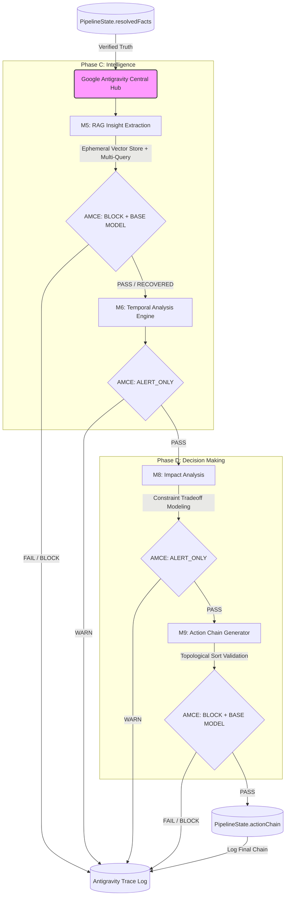

# Workflow Diagram: Phase 2 Orchestration (M5, M6, M8, M9)

```mermaid
graph TD
    %% Core Orchestration
    A[(PipelineState.resolvedFacts)] -->|Verified Truth| B(Google Antigravity Central Hub)
    
    %% Phase C: Intelligence
    subgraph Phase C: Intelligence
        B --> C[M5: RAG Insight Extraction]
        C -->|Ephemeral Vector Store + Multi-Query| AMCE5{AMCE: BLOCK + BASE MODEL}
        AMCE5 -->|PASS / RECOVERED| D[M6: Temporal Analysis Engine]
        D --> AMCE6{AMCE: ALERT_ONLY}
    end

    %% Phase D: Decision Making
    subgraph Phase D: Decision Making
        AMCE6 -->|PASS| E[M8: Impact Analysis]
        E -->|Constraint Tradeoff Modeling| AMCE8{AMCE: ALERT_ONLY}
        AMCE8 -->|PASS| F[M9: Action Chain Generator]
        F -->|Topological Sort Validation| AMCE9{AMCE: BLOCK + BASE MODEL}
    end

    %% Trace Logging
    AMCE9 -->|PASS| G[(PipelineState.actionChain)]
    
    AMCE5 -->|FAIL / BLOCK| Trace[(Antigravity Trace Log)]
    AMCE6 -->|WARN| Trace
    AMCE8 -->|WARN| Trace
    AMCE9 -->|FAIL / BLOCK| Trace
    G -->|Log Final Chain| Trace

    classDef router fill:#f9f,stroke:#333,stroke-width:2px;
    class B router;
```
