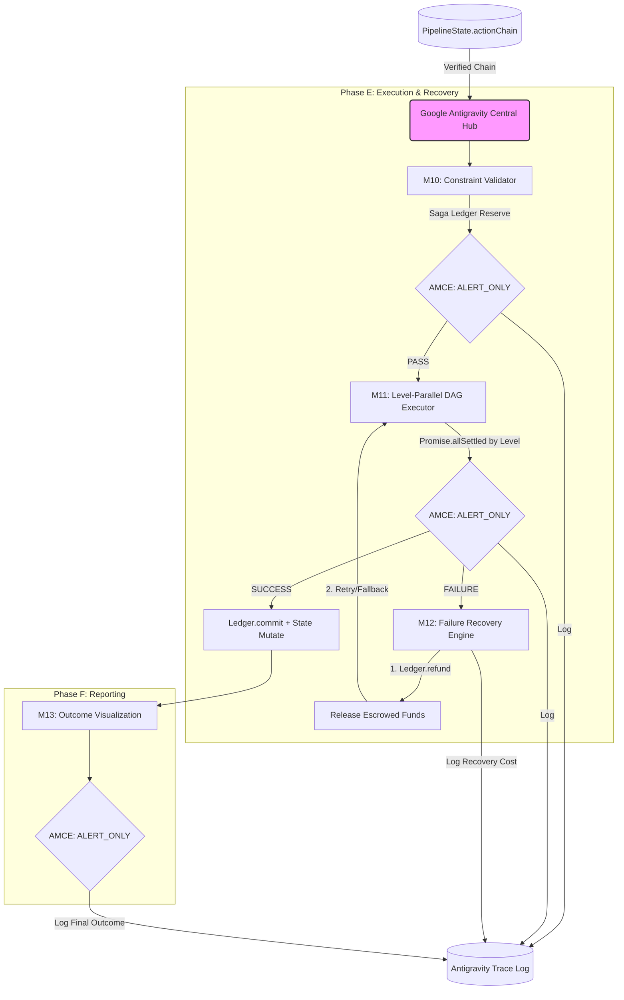

# Workflow Diagram: Phase 3 Orchestration (M10-M13)

```mermaid
graph TD
    %% Core Orchestration
    A[(PipelineState.actionChain)] -->|Verified Chain| B(Google Antigravity Central Hub)
    
    subgraph Phase E: Execution & Recovery
        B --> C[M10: Constraint Validator]
        C -->|Saga Ledger Reserve| AMCE10{AMCE: ALERT_ONLY}
        AMCE10 -->|PASS| D[M11: Level-Parallel DAG Executor]
        D -->|Promise.allSettled by Level| AMCE11{AMCE: ALERT_ONLY}
        
        AMCE11 -->|SUCCESS| Commit[Ledger.commit + State Mutate]
        AMCE11 -->|FAILURE| E[M12: Failure Recovery Engine]
        
        E -->|1. Ledger.refund| Refund[Release Escrowed Funds]
        Refund -->|2. Retry/Fallback| D
    end

    subgraph Phase F: Reporting
        Commit --> F[M13: Outcome Visualization]
        F --> AMCE13{AMCE: ALERT_ONLY}
    end

    %% Trace Logging
    AMCE10 -->|Log| Trace[(Antigravity Trace Log)]
    AMCE11 -->|Log| Trace
    E -->|Log Recovery Cost| Trace
    AMCE13 -->|Log Final Outcome| Trace

    classDef router fill:#f9f,stroke:#333,stroke-width:2px;
    class B router;
```
