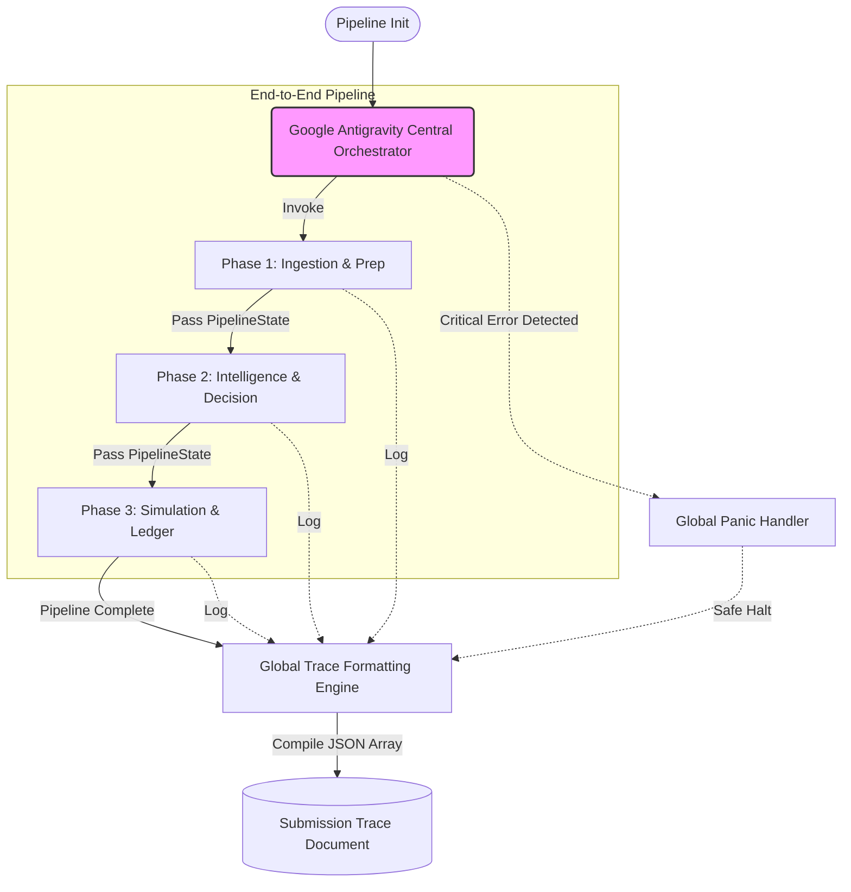

# Workflow Diagram: Phase 4 Macro Orchestration (End-to-End)

```mermaid
graph TD
    %% Core Overarching Orchestration
    Start([Pipeline Init]) --> A(Google Antigravity Central Orchestrator)
    
    %% Macro Subsystems
    subgraph End-to-End Pipeline
        A -->|Invoke| P1[Phase 1: Ingestion & Prep]
        P1 -->|Pass PipelineState| P2[Phase 2: Intelligence & Decision]
        P2 -->|Pass PipelineState| P3[Phase 3: Simulation & Ledger]
    end

    %% Global Fallback
    A -.->|Critical Error Detected| Panic[Global Panic Handler]
    Panic -.->|Safe Halt| TraceFormatter

    %% Trace Compilation
    P3 -->|Pipeline Complete| TraceFormatter[Global Trace Formatting Engine]
    TraceFormatter -->|Compile JSON Array| FinalOutput[(Submission Trace Document)]

    %% Execution Log Feeds
    P1 -.->|Log| TraceFormatter
    P2 -.->|Log| TraceFormatter
    P3 -.->|Log| TraceFormatter

    classDef orchestrator fill:#f9f,stroke:#333,stroke-width:2px;
    class A orchestrator;
```
