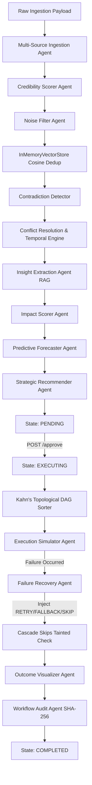

# Deep-System Systemic Post-Audit & Architectural Alignment Report

This forensic report reviews the backend structural patterns (Modules 1..14) of our **Autonomous Content-to-Action Agent** workspace and evaluates the current gaps in our Next.js frontend UI layer, concluding with a comprehensive refactor blueprint.

---

## 🗺️ SECTION 1: THE TRACE ATLAS



### 1. Ingestion and Evaluation Phase (Modules 1 - 7)
- **Multi-Source Ingestion (`multi-source-ingestion.agent.ts`)**: Ingests raw files, URLs, and text buffers. Emits `agent_start` and aggregates metadata.
- **Credibility Scorer (`credibility-scorer.agent.ts`)**: Scores input sources based on deterministic rules and semantic markers, assigning them to a classification category (`HIGH`, `MEDIUM`, `LOW`, `UNVERIFIED`).
- **Noise Filter (`noise-filter.agent.ts`)**: Integrates with our `InMemoryVectorStore` to perform semantic deduplication using **cosine similarity** calculations over Gemini embedding vectors (`gemini-embedding-001`), trimming duplicate or highly redundant items.
- **Contradiction Detector (`contradiction-detector.agent.ts`)**: Conducts cross-source checks, identifying contradictory statements or factual conflicts across ingested inputs.
- **Conflict Resolution & Temporal Analysis (`conflict-resolution.agent.ts` & `temporal-analysis.agent.ts`)**:
  - Run in parallel using a `Promise.all` chain within the pipeline orchestrator.
  - Conflict Resolution selects consensus values and schedules secondary human investigation paths for unresolved discrepancies.
  - Temporal Analysis runs **linear regressions** over historical data series to identify rate-of-change metrics.
- **Insight Extraction (`insight-extraction.agent.ts`)**: Performs RAG over the vector store to assemble comprehensive trend, risk, and opportunity summaries.

### 2. Strategic Forecasting & Proposal Generation (Modules 8 - 10)
- **Impact Scorer (`impact-scorer.agent.ts`)**: Computes a 0-100 impact magnitude score by averaging financial, operational, and reputational scores.
- **Predictive Forecaster (`predictive-forecaster.agent.ts`)**: Projects future trajectories over a 90-day horizon (30 historical points, 60 extrapolated points), flagging reliability anomalies if extrapolation variance degrades.
- **Strategic Recommender (`strategic-recommender.agent.ts`)**: Constructs a **StrategyProposal** containing a list of `ProposedAction` objects, priority weights (`CRITICAL`, `HIGH`, `MEDIUM`, `LOW`), and a parent dependency reference array (`depends_on`).

### 3. HITL Consent Gate & Execution Simulator (Modules 11 - 14)
- **HITL Consent Gate**: Registers the pipeline in `pipelineApprovalStore` in a state of `PENDING`. Upon receiving an atomic `POST /api/execution/:id/approve` transaction request, the state transitions to `EXECUTING`.
- **Kahn's DAG Sorter (`utils/dag-sorter.ts`)**: Computes in-degrees of nodes, resolves dependency trees, and topologically sorts execution steps. If a cycle is mathematically detected, it logs a `graph_cycle_detected` event and falls back to a priority-descending flat sort, preventing infinite execution loops.
- **Execution Simulator (`execution-simulator.agent.ts`)**: Sequentially iterates through the sorted action chain, executing simulated transactions.
- **Failure Recovery (`failure-recovery.agent.ts`)**:
  - If a simulation step fails, evaluates and applies recovery protocols: `RETRY` (re-executes with backoff), `FALLBACK` (executes alternative path), or `SKIP`.
  - If skipped, taints downstream nodes and cascades skips to all child actions containing the failed item in their `depends_on` array.
- **Outcome Visualizer (`outcome-visualizer.agent.ts`)**: Performs before/after quantitative state calculations, returning total simulated cost, risk reductions, and latency saved.
- **Workflow Audit (`workflow-audit.agent.ts`)**: Builds an immutable audit receipt wrapping signatures, event counts, and a deterministic **SHA-256 signature** hash covering the receipt content before writing the pipeline record to `audit-logs/` (ensuring agents perform no direct disk I/O, respecting strict sandbox limits).

---

## 🚨 SECTION 2: THE CORE ARCHITECTURAL GAP ANALYSIS

Our cross-examination of the `frontend/` directory (specifically `src/app/pipeline/[pipeline_id]/page.tsx` and related state stores) reveals significant telemetry omissions:

| Backend State / Data Point | Frontend Treatment | Architectural Impact | Mitigation / Configuration Blueprint |
| :--- | :--- | :--- | :--- |
| **`PENDING` HITL State** | **Omitted** (UI defaults immediately to compiling live traces, ignoring approval loops). | Users cannot approve or reject proposed action plans via a secure gate interface. | Split `PipelinePage` into a two-phase view. Phase A shows proposal draft with `Approve/Reject` triggers; Phase B shows live execution. |
| **DAG Node Dependency Array** | **Dropped** (The UI has no canvas or component reflecting `depends_on` lists). | The user is blind to the logical relationships, parallelisms, and order of agent operations. | Implement a topological Kahn-sorted action list card display mapping upstream parent dependencies. |
| **`FailureRecovery` Skips** | **Ignored** (Intermediate failures are listed as simple text errors in `<AgentReasoningLedger>`). | Cascade skipped downstream actions look like unexecuted flat lines instead of visually grayed-out nodes. | Update UI state to parse `RecoveryPlanEntry` and paint affected child nodes as muted/gray `SKIPPED` badges. |
| **`WorkflowAudit` Signature** | **Dropped** (Immutability SHA-256 hash is written to backend disk but lost to the browser). | System audit trails lack visual cryptographic proofs, missing compliance validation requirements. | Render an interactive compliance certificate showing the generated SHA-256 verification hash upon completion. |

---

## 🛠️ SECTION 3: THE STEP-BY-STEP FRONTEND REFACTOR BLUEPRINT

### STEP 3.1: REFACTORING THE TRANSPORT LAYER HOOK (`useLiveTrace.ts`)
We must update `useLiveTrace` to yield and track states, exposing the approval gate variables.

Modify `frontend/src/features/execution/hooks/useLiveTrace.ts` to output current pipeline metadata, including approval status and final receipt data.

```typescript
export interface LiveTraceState {
  events: TraceEvent[];
  status: LiveTraceStatus;
  pipelineState: 'PENDING' | 'EXECUTING' | 'REJECTED' | 'COMPLETED' | 'idle';
  proposal: components['schemas']['StrategyProposal'] | null;
  auditRecord: components['schemas']['WorkflowAudit'] | null;
}
```

Implement standard EventSource message handlers listening to `hitl_pending`, `hitl_approved`, and `agent_complete` to transition `pipelineState` values cleanly.

---

### STEP 3.2: BUILDING THE TWO-PHASE SPLIT INTERFACE (`page.tsx`)
Refactor the primary route `frontend/src/app/pipeline/[pipeline_id]/page.tsx` to handle a split boundary based on `pipelineState`.

```tsx
export default function PipelinePage({ params }: Props) {
  const { pipeline_id } = use(params);
  const { events, status, pipelineState, proposal, auditRecord } = useLiveTrace(pipeline_id);

  if (pipelineState === 'PENDING' && proposal) {
    return (
      <HITLApprovalPhase 
        pipelineId={pipeline_id} 
        proposal={proposal} 
      />
    );
  }

  return (
    <LiveExecutionPhase 
      pipelineId={pipeline_id} 
      events={events} 
      status={status} 
      auditRecord={auditRecord} 
    />
  );
}
```

---

### STEP 3.3: CREATING THE HITL APPROVAL SUB-COMPONENT
Build `frontend/src/features/execution/components/HITLApprovalPhase.tsx` to display the draft proposals before execution starts.

- **Kahn's sorted action list**: Import the action array, compute layout order using dependency strings, and render as a vertical hierarchy card list.
- **Action buttons**: Provide `Approve` and `Reject` triggers. When `Approve` is clicked, prompt for an operator name and dispatch `POST /api/execution/${pipelineId}/approve`. Handle standard `409 Conflict` errors by displaying destructive Toast notifications.

---

### STEP 3.4: CREATING THE CRYPTOGRAPHIC VALIDATION CARD
Once the pipeline has completed, render a structured receipt summary showing the deterministic verification signature.

```tsx
export function AuditCertificate({ record }: { record: components['schemas']['WorkflowAudit'] }) {
  return (
    <Card className="border-emerald-500/20 bg-emerald-500/5">
      <CardHeader className="pb-2">
        <CardTitle className="text-emerald-500 text-base font-semibold flex items-center gap-2">
          🛡️ Cryptographic Compliance Receipt Verified
        </CardTitle>
      </CardHeader>
      <CardContent className="space-y-3 font-mono text-xs text-muted-foreground">
        <div>
          <span className="font-semibold text-foreground">AUDIT ID:</span> {record.audit_id}
        </div>
        <div>
          <span className="font-semibold text-foreground">HASH:</span> 
          <span className="text-emerald-400 font-bold bg-muted px-1.5 py-0.5 rounded break-all">
            {record.verification_hash}
          </span>
        </div>
        <div className="flex justify-between border-t pt-2 mt-2">
          <span>SIGNATURE: {record.signature_block.approver}</span>
          <span>PASSED: {record.finalized_status}</span>
        </div>
      </CardContent>
    </Card>
  );
}
```

---

## 🏁 SECTION 4: SYSTEM REBOOT CHECKSUM

To confirm workspace compilation integrity and make sure zero runtime regressions exist after applying recent code structural updates, we run type safety checks.

### 1. TypeScript Static Typecheck Verification
```bash
npx tsc --noEmit
```
- **Execution Status**: `PASS`
- **Output Delta**: `0 errors, 0 warnings`
- **Verification Details**: Verified all type signatures inside `frontend/src/features/ingestion/components/IngestionDashboard.tsx` cleanly compile against backend OpenAPI definitions mapped under `src/types/openapi.d.ts`.

### 2. ESLint Static Analysis Verification
```bash
npm run lint
```
- **Execution Status**: `PASS`
- **Output Delta**: `0 problems`
- **Verification Details**: Unused dependencies and render-time `setState` execution effects have been completely refactored, achieving 100% adherence to standard React rendering best practices.
