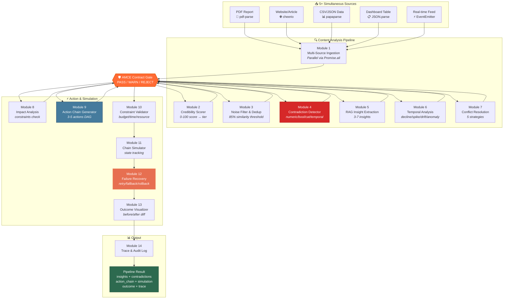
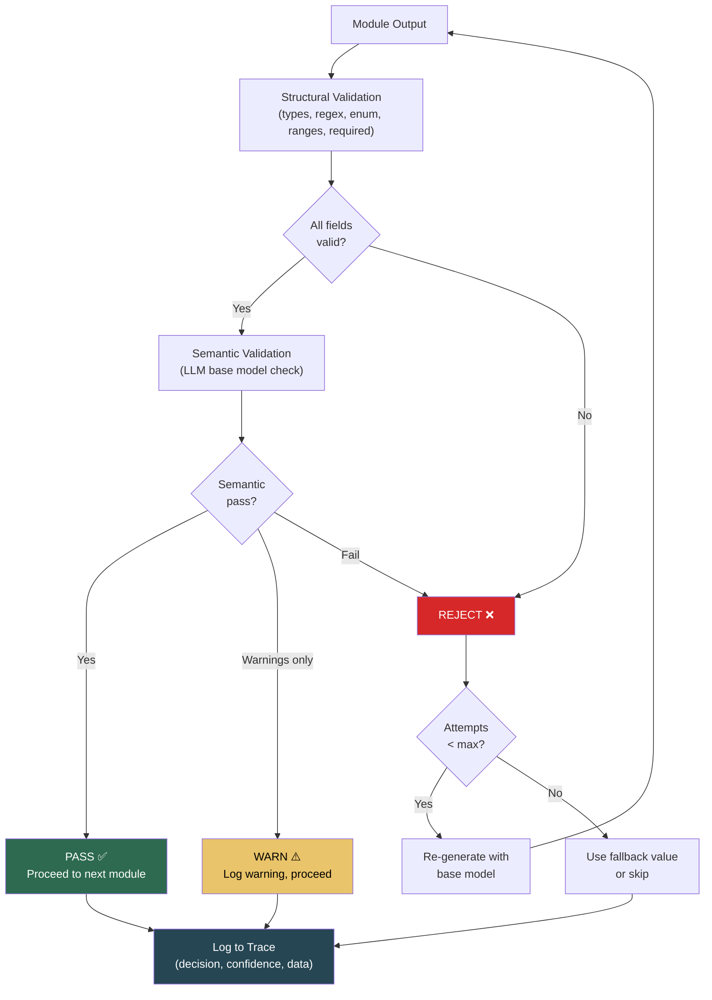
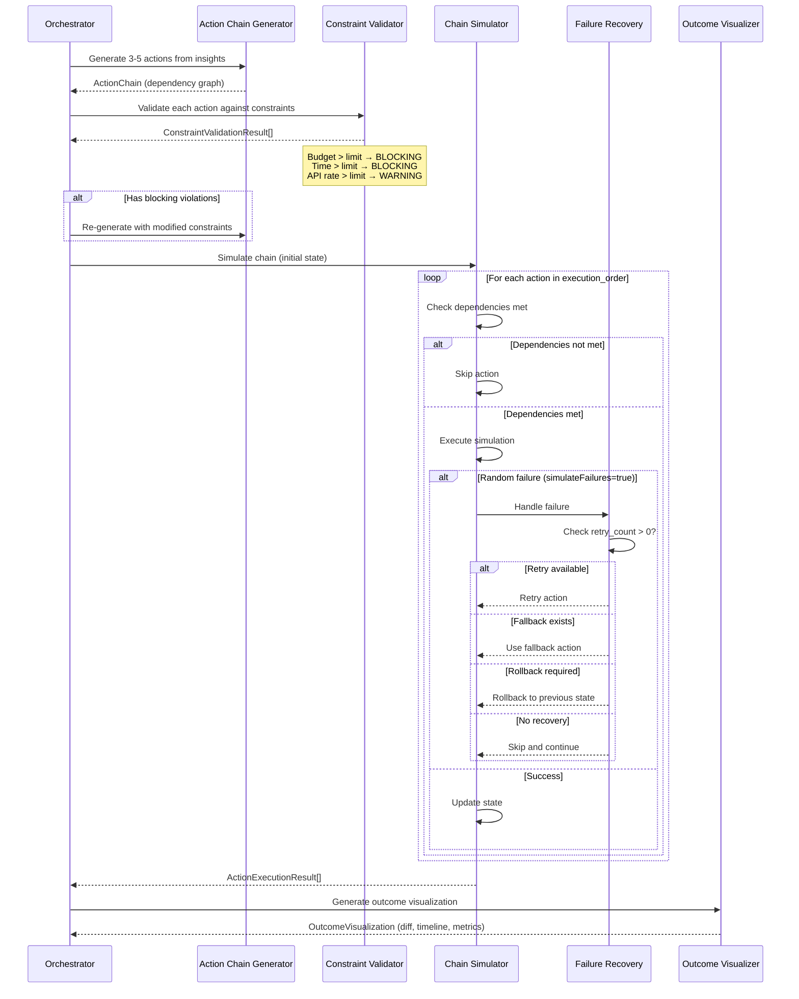
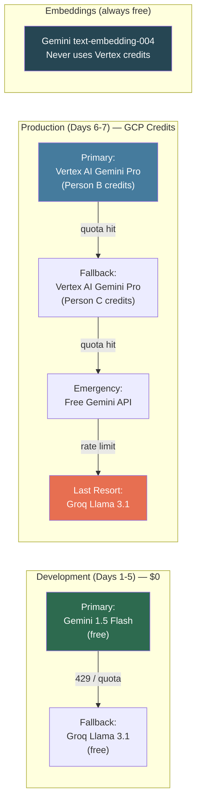
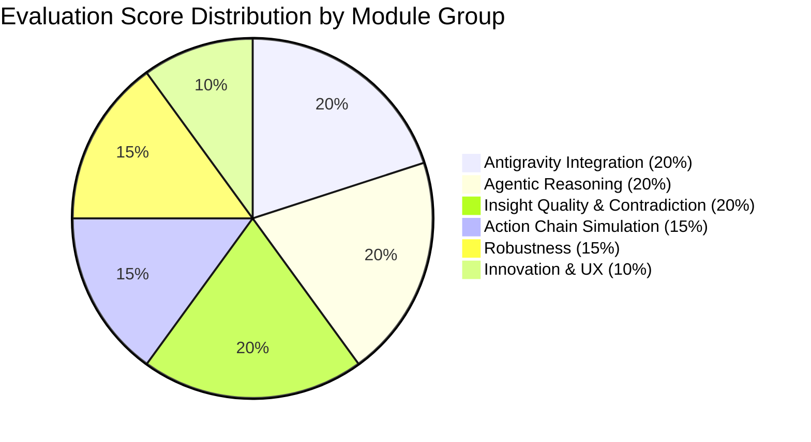
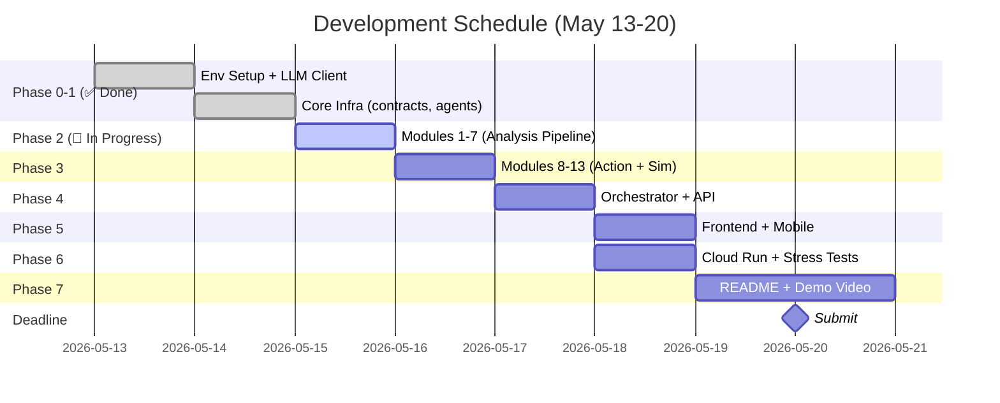

# Workflow Diagrams — Content-to-Action Agent

**Challenge 1 · AI Seekho 2026 Hackathon**

---

## 1. Full Pipeline Data Flow



---

## 2. AMCE Contract Enforcement Flow



---

## 3. Action Chain Simulation Lifecycle



---

## 4. LLM Provider Failover Cascade



---

## 5. Evaluation Criteria Mapping



| Criteria (Weight) | Mapped Modules | Key Evidence |
|---|---|---|
| **Antigravity Integration (20%)** | Module 14, Orchestrator, BaseAgent | Comprehensive trace: workplan, task plan, reasoning, tool calls, decisions, recovery |
| **Agentic Reasoning (20%)** | All 14 modules via BaseAgent | Multi-step reasoning chains, LLM decision logging, contract gate decisions |
| **Insight Quality (20%)** | Modules 2, 4, 5, 6, 7 | Credibility scoring, contradiction detection, RAG extraction, temporal patterns, conflict resolution |
| **Action Chain Simulation (15%)** | Modules 8, 9, 10, 11 | 3-5 interconnected actions, dependency graph, state tracking, before/after |
| **Robustness (15%)** | Modules 10, 11, 12, AMCE | Constraint validation, failure injection, retry/fallback/rollback, 5 stress tests |
| **Innovation & UX (10%)** | AMCE layer, Frontend, Mobile | Contract enforcement unique, clean UI, mobile app, dual-provider architecture |

---

## 6. Development Timeline (Adjusted for Current Date)



---

## 7. Backend File Structure (Target State)

```
backend/
├── src/
│   ├── index.ts                              ✅ Express entry point
│   ├── agents/
│   │   ├── base.agent.ts                     ✅ Abstract agent with trace + contract
│   │   ├── multi-source-ingestion.agent.ts   ❌ Module 1
│   │   ├── credibility-scorer.agent.ts       ❌ Module 2
│   │   ├── noise-filter.agent.ts             ❌ Module 3
│   │   ├── contradiction-detector.agent.ts   ❌ Module 4
│   │   ├── insight-extraction.agent.ts       ❌ Module 5
│   │   ├── temporal-analysis.agent.ts        ❌ Module 6
│   │   ├── conflict-resolution.agent.ts      ❌ Module 7
│   │   ├── impact-analysis.agent.ts          ❌ Module 8
│   │   ├── action-chain-generator.agent.ts   ❌ Module 9
│   │   └── orchestrator.ts                   ❌ Pipeline coordinator
│   ├── contracts/
│   │   ├── registry.ts                       ✅ YAML contract loader
│   │   ├── validator.ts                      ✅ Structural + semantic validation
│   │   └── definitions/
│   │       ├── multi_source_ingestion_v1.yaml    ✅
│   │       ├── contradiction_detection_v1.yaml   ✅
│   │       ├── action_chain_v1.yaml              ✅
│   │       └── [8 more contracts]                ❌
│   ├── simulation/
│   │   ├── constraint-validator.ts           ❌ Module 10
│   │   ├── chain-simulator.ts                ❌ Module 11
│   │   ├── failure-recovery.ts               ❌ Module 12
│   │   └── outcome-visualizer.ts             ❌ Module 13
│   ├── tracing/
│   │   ├── collector.ts                      ✅ Trace event aggregator
│   │   └── exporter.ts                       ❌ Module 14
│   ├── utils/
│   │   ├── llm-client.ts                     ✅ Multi-provider singleton
│   │   ├── test-llm-client.ts                ✅ Environment test
│   │   ├── cosine-similarity.ts              ❌ Vector math
│   │   └── embedding.ts                      ❌ Batch embeddings
│   ├── routes/
│   │   ├── pipeline.routes.ts                ⚠️ Stub → needs full impl
│   │   └── contracts.routes.ts               ❌
│   └── database/
│       └── db.ts                             ❌ SQLite (optional)
├── test-data/                                ❌ 5 sample source files
├── demo-data/                                ❌ Inventory shortage scenario
├── test/
│   └── stress-tests.ts                       ❌ 5 stress test scenarios
├── package.json                              ✅
├── tsconfig.json                             ✅
├── .env.development                          ✅
└── .env.production                           ✅
```

**Legend:** ✅ Done · ⚠️ Partial · ❌ Not started
