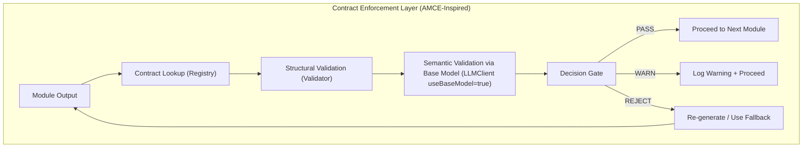

# Phase 1: Core Infrastructure — Implementation Plan

> **Context:** Challenge 1 — Autonomous Content-to-Action Agent (AI Seekho 2026 Hackathon)  
> **Phase Scope:** Phase 1 only (Steps 1.1 – 1.4 from Development Roadmap)  
> **Duration:** 6–8 hours (Day 1 Afternoon – Day 2 Morning)  
> **Evaluation Criteria Addressed:** Antigravity Integration (20%), Technical Implementation foundation  
> **Deadline:** May 20, 2026  

---

## Background & Goal

Phase 1 establishes the **core infrastructure** on which all 14 pipeline modules will run. It does NOT implement the pipeline modules themselves (that's Phase 2+), but instead delivers the four foundational pillars every module depends on:

1. **LLMClient Singleton Wiring** — Ensure every agent uses `llmClient` from `../utils/llm-client` and never imports AI SDKs directly.  
2. **AMCE Contract Enforcement Layer** — Registry, Validator, Decision Gate, and YAML contract definitions that validate every module output against base models.  
3. **Base Agent Framework + Trace Collector** — Standardized agent superclass with Antigravity trace logging (workplan, task plan, reasoning, tool calls, decisions, failures).  
4. **Express API Server** — HTTP routes for pipeline execution, trace retrieval, contract listing, and validation history.

---

## 14-Module Architecture Reference

The full pipeline flows through these modules sequentially, with a **Contract Enforcement Gate** between each:

| # | Module | Purpose |
|---|--------|---------|
| 1 | Multi-Source Content Ingestion | Ingest 5+ sources in parallel (PDF, URL, CSV, JSON, real-time feed) |
| 2 | Source Credibility Scorer | Score each source 0–100 (recency + authority + quality) |
| 3 | Noise Filter & Deduplication | Remove duplicates (>85% similarity), spam, stale data |
| 4 | Contradiction Detector | Detect numeric/boolean/categorical/temporal conflicts across sources |
| 5 | RAG-Powered Insight Extraction | Extract 3–7 actionable insights using RAG |
| 6 | Temporal Analysis Engine | Detect decline, spike, drift, anomaly patterns |
| 7 | Conflict Resolution Logic | Resolve contradictions without forcing false conclusions |
| 8 | Impact Analysis with Constraints | Analyze impact under budget/time/resource/urgency constraints |
| 9 | Action Chain Generator | Generate 3–5 interconnected actions with dependency graphs |
| 10 | Constraint Validator | Reject/modify infeasible actions |
| 11 | Action Chain Execution Simulator | Simulate execution with state tracking and failure injection |
| 12 | Failure Recovery & Rollback Engine | Retry, fallback, or rollback on failures |
| 13 | Outcome Visualization | Before/after state, cost/latency metrics, projected impact |
| 14 | Agentic Workflow Trace & Audit Logs | Workplan, task plan, reasoning, tool calls, decisions |

**Phase 1 builds the infrastructure these modules plug into — not the modules themselves.**

---

## AMCE Contract Enforcement Layer — Architecture



**Key Components:**
- **Contract Registry** (`contracts/registry.ts`) — Loads YAML contract definitions, version management, contract lookup by module name
- **Contract Validator** (`contracts/validator.ts`) — Structural validation (field presence, types, enums, ranges, regex) + semantic validation via base model
- **Decision Gate** (`contracts/decision-gate.ts`) — Evaluates validation results → PASS / WARN / REJECT
- **Contract Definitions** (`contracts/definitions/*.yaml`) — YAML schemas per module with `enforcement_mode` (BLOCK, QUARANTINE, LOG)

---

## Current Project State Analysis

### What Already Exists (from Phase 0)

| File | Status | Notes |
|------|--------|-------|
| [llm-client.ts](file:///c:/Users/USER/Downloads/AISeekho2026_Challenge1/AI-Seekho-Hackathon-Qualifying-Round/backend/src/utils/llm-client.ts) | ✅ Built | Multi-provider LLMClient with Gemini/Groq/Vertex AI, environment switching, fallback chain |
| [test-llm-client.ts](file:///c:/Users/USER/Downloads/AISeekho2026_Challenge1/AI-Seekho-Hackathon-Qualifying-Round/backend/src/utils/test-llm-client.ts) | ✅ Built | Environment test script |
| [cosine-similarity.ts](file:///c:/Users/USER/Downloads/AISeekho2026_Challenge1/AI-Seekho-Hackathon-Qualifying-Round/backend/src/utils/cosine-similarity.ts) | ✅ Built | Vector similarity utility |
| [tsconfig.json](file:///c:/Users/USER/Downloads/AISeekho2026_Challenge1/AI-Seekho-Hackathon-Qualifying-Round/backend/tsconfig.json) | ✅ Built | TypeScript config |
| [package.json](file:///c:/Users/USER/Downloads/AISeekho2026_Challenge1/AI-Seekho-Hackathon-Qualifying-Round/backend/package.json) | ✅ Built | Dependencies installed |
| `.env.development` | ✅ Created | Free API keys configured |

### What Exists But Needs Phase 1 Review/Hardening

| File | Status | Action Needed |
|------|--------|---------------|
| [registry.ts](file:///c:/Users/USER/Downloads/AISeekho2026_Challenge1/AI-Seekho-Hackathon-Qualifying-Round/backend/src/contracts/registry.ts) | ⚠️ Exists (2.1 KB) | Audit: Verify YAML loading, version management, contract lookup match master prompt spec |
| [validator.ts](file:///c:/Users/USER/Downloads/AISeekho2026_Challenge1/AI-Seekho-Hackathon-Qualifying-Round/backend/src/contracts/validator.ts) | ⚠️ Exists (5.7 KB) | Audit: Verify structural + semantic validation, base model integration, all rules from master prompt |
| [base.agent.ts](file:///c:/Users/USER/Downloads/AISeekho2026_Challenge1/AI-Seekho-Hackathon-Qualifying-Round/backend/src/agents/base.agent.ts) | ⚠️ Exists (5.4 KB) | Audit: Verify trace logging, retry logic, contract validator integration |
| [collector.ts](file:///c:/Users/USER/Downloads/AISeekho2026_Challenge1/AI-Seekho-Hackathon-Qualifying-Round/backend/src/tracing/collector.ts) | ⚠️ Exists (4.0 KB) | Audit: Verify aggregation of all agent traces |
| [exporter.ts](file:///c:/Users/USER/Downloads/AISeekho2026_Challenge1/AI-Seekho-Hackathon-Qualifying-Round/backend/src/tracing/exporter.ts) | ⚠️ Exists (2.7 KB) | Audit: Verify export format matches judge expectations (workplan, task plan, reasoning, tool calls, recovery, provider info) |
| [index.ts](file:///c:/Users/USER/Downloads/AISeekho2026_Challenge1/AI-Seekho-Hackathon-Qualifying-Round/backend/src/index.ts) | ⚠️ Exists (2.6 KB) | Audit: Verify all 5 routes exist, CORS config, error handling |
| [pipeline.routes.ts](file:///c:/Users/USER/Downloads/AISeekho2026_Challenge1/AI-Seekho-Hackathon-Qualifying-Round/backend/src/routes/pipeline.routes.ts) | ⚠️ Exists (2.5 KB) | Audit: Verify POST /run, GET /:id, GET /:id/trace endpoints |

### What's Missing for Phase 1

| File | Status | Must Create |
|------|--------|-------------|
| `contracts/decision-gate.ts` | ❌ Missing | PASS/WARN/REJECT decision logic with trace event generation |
| `contracts/benchmark.ts` | ❌ Missing | Base model benchmark comparison (AMCE divergence scoring) |
| `contracts/definitions/multi_source_ingestion_v1.yaml` | ❓ Unknown | Verify existence, must match master prompt spec exactly |
| `contracts/definitions/contradiction_detection_v1.yaml` | ❓ Unknown | Verify existence, must match master prompt spec exactly |
| `contracts/definitions/action_chain_v1.yaml` | ❓ Unknown | Verify existence, must match master prompt spec exactly |
| `routes/contracts.routes.ts` | ❌ Missing | GET /api/contracts endpoint |
| `routes/validations.routes.ts` | ❌ Missing | GET /api/validations endpoint |
| Smoke test for LLMClient singleton | ❌ Missing | Verify all agents import singleton correctly |

---

## Proposed Changes

### Component 1: LLMClient Singleton Wiring (Step 1.1)

> Ensure every existing agent file imports `llmClient` from `../utils/llm-client` and never imports `@google/generative-ai` or `groq-sdk` directly.

#### [AUDIT] All 11 agent files in `backend/src/agents/`

- Scan every `.agent.ts` file for direct AI SDK imports
- Replace any `import { GoogleGenerativeAI }` or `import Groq` with `import { llmClient }` pattern
- Create `backend/src/utils/test-singleton-smoke.ts` — quick test that imports `llmClient` and calls `complete()` with a test prompt

---

### Component 2: AMCE Contract Enforcement Layer (Step 1.2)

#### [AUDIT] [registry.ts](file:///c:/Users/USER/Downloads/AISeekho2026_Challenge1/AI-Seekho-Hackathon-Qualifying-Round/backend/src/contracts/registry.ts)

- Verify: Loads contracts from YAML files in `definitions/` directory
- Verify: Version management (supports `_v1`, `_v2` etc.)
- Verify: `getContract(moduleName: string)` lookup method
- Fix any gaps against master prompt spec

#### [AUDIT] [validator.ts](file:///c:/Users/USER/Downloads/AISeekho2026_Challenge1/AI-Seekho-Hackathon-Qualifying-Round/backend/src/contracts/validator.ts)

- Verify: Structural validation — field presence, types, enums, ranges, regex patterns, nullable checks, min_items, min_length
- Verify: Semantic validation via `llmClient.complete(prompt, true)` (base model)
- Verify: Returns structured result with `isValid`, `violations[]`, `warnings[]`
- Fix any gaps against the contract schemas defined in master prompt (lines 309–334, 667–683)

#### [NEW] `backend/src/contracts/decision-gate.ts`

- Implement Decision Gate class that evaluates validator output
- Logic: If structural violations → REJECT; If semantic divergence > threshold → WARN; Otherwise → PASS
- Generate `TraceEvent` for each decision (logged to collector)
- Handle REJECT: trigger re-generation with stricter prompt or use fallback
- Match the AMCE architecture from master prompt (lines 83–98)

#### [NEW] `backend/src/contracts/benchmark.ts`

- Implement base model benchmark comparison
- Takes module output + original input → calls base model with same prompt → compares outputs
- Computes divergence score (semantic similarity between primary model and base model outputs)
- Threshold: divergence > 0.3 → WARN, divergence > 0.6 → REJECT

#### [AUDIT/CREATE] Contract YAML Definitions

Verify or create these three contracts in `backend/src/contracts/definitions/`:

**`multi_source_ingestion_v1.yaml`** — Must match master prompt (lines 309–334):
```yaml
contract_id: "multi_source_ingestion_v1"
module_name: "multi_source_ingestion_agent"
version: "1.0.0"
output_schema:
  sources:
    type: array
    min_items: 5
    items:
      source_id: { type: string, nullable: false }
      source_type: { type: enum, values: ["pdf","url","csv","json","table","realtime_feed"], nullable: false }
      raw_text: { type: string, min_length: 20, nullable: false }
      timestamp: { type: string, regex_pattern: "^\\d{4}-\\d{2}-\\d{2}T\\d{2}:\\d{2}:\\d{2}", nullable: false }
enforcement_mode: "BLOCK"
```

**`contradiction_detection_v1.yaml`** — Must match master prompt (lines 667–683):
```yaml
contract_id: "contradiction_detection_v1"
output_schema:
  contradictions:
    type: array
    items:
      contradiction_id: { type: string, nullable: false }
      severity: { type: enum, values: ["CRITICAL","HIGH","MEDIUM","LOW"], nullable: false }
      resolution_needed: { type: boolean, nullable: false }
enforcement_mode: "QUARANTINE"
```

**`action_chain_v1.yaml`** — Derived from master prompt Module 9 spec (lines 981–1095):
```yaml
contract_id: "action_chain_v1"
output_schema:
  actions:
    type: array
    min_items: 3
    max_items: 5
    items:
      action_id: { type: string, nullable: false }
      action_type: { type: enum, values: ["diagnose","notify","update_system","mitigate","monitor","verify","escalate"], nullable: false }
      depends_on: { type: array, nullable: false }
      simulatable: { type: boolean, nullable: false }
  execution_order:
    type: array
    min_items: 3
enforcement_mode: "BLOCK"
```

---

### Component 3: Base Agent Framework + Trace Collector (Step 1.3)

> **This is CRITICAL for 20% of the evaluation score (Antigravity Integration).**

#### [AUDIT] [base.agent.ts](file:///c:/Users/USER/Downloads/AISeekho2026_Challenge1/AI-Seekho-Hackathon-Qualifying-Round/backend/src/agents/base.agent.ts)

Verify the base agent class includes:
- `llmClient` integration (imported from `../utils/llm-client`)
- Trace event logging for: reasoning, tool_usage, decisions, inputs, outputs
- Contract validator integration (validate output after execution)
- Retry logic for failures (with configurable retry count)
- Error handling with fallback behavior
- Timing/latency tracking per execution

#### [AUDIT] [collector.ts](file:///c:/Users/USER/Downloads/AISeekho2026_Challenge1/AI-Seekho-Hackathon-Qualifying-Round/backend/src/tracing/collector.ts)

Verify the trace collector:
- Is a singleton that aggregates all agent trace events
- Stores: workplan, task_plan, reasoning_steps[], tool_calls[], decisions[], failures[], recovery_steps[]
- Supports `log(traceEvent)` method
- Supports `export()` method that returns the complete trace

#### [AUDIT] [exporter.ts](file:///c:/Users/USER/Downloads/AISeekho2026_Challenge1/AI-Seekho-Hackathon-Qualifying-Round/backend/src/tracing/exporter.ts)

Verify the trace exporter outputs this exact structure (from roadmap lines 911–946):
```json
{
  "pipeline_id": "uuid",
  "environment": "development | production",
  "ai_provider_used": "gemini-free | vertex-ai | groq",
  "workplan": "...",
  "task_plan": ["Task 1: Ingest 5 sources", ...],
  "reasoning_steps": [{ "step": 1, "agent": "...", "reasoning": "...", "decision": "...", "confidence": 0.92 }],
  "tool_calls": [{ "tool": "gemini_llm", "provider": "...", "input": "...", "output": "..." }],
  "action_execution": [{ "action": "...", "status": "...", "duration_ms": 234 }],
  "recovery_steps": ["..."]
}
```

> [!IMPORTANT]
> The `environment` and `ai_provider_used` fields are mandatory — judges specifically check these to verify the system works across both development and production providers.

---

### Component 4: Express API Server (Step 1.4)

#### [AUDIT] [index.ts](file:///c:/Users/USER/Downloads/AISeekho2026_Challenge1/AI-Seekho-Hackathon-Qualifying-Round/backend/src/index.ts)

Verify Express server setup includes:
- CORS configuration (localhost:3000 + Firebase URL placeholder)
- Body parsing (`express.json()` with increased limit for PDF base64)
- Route registration for all 5 endpoint groups
- Global error handling middleware
- Route logging middleware
- Startup log showing LLMClient environment

#### [AUDIT] [pipeline.routes.ts](file:///c:/Users/USER/Downloads/AISeekho2026_Challenge1/AI-Seekho-Hackathon-Qualifying-Round/backend/src/routes/pipeline.routes.ts)

Verify these endpoints exist:
- `POST /api/pipeline/run` — Main pipeline execution (accepts 5+ sources + constraints)
- `GET /api/pipeline/:id` — Get pipeline results by ID
- `GET /api/pipeline/:id/trace` — Get Antigravity trace logs for a pipeline run

#### [NEW] `backend/src/routes/contracts.routes.ts`

- `GET /api/contracts` — List all loaded contract definitions
- `GET /api/contracts/:id` — Get specific contract details

#### [NEW] `backend/src/routes/validations.routes.ts`

- `GET /api/validations` — Get validation history (all past validations)
- `GET /api/validations/:pipelineId` — Get validations for a specific pipeline run

---

## Verification Plan

### Automated Tests

```bash
# 1. Verify LLMClient singleton works
APP_ENV=development npx ts-node src/utils/test-singleton-smoke.ts

# 2. Verify contract registry loads all YAML definitions
APP_ENV=development npx ts-node src/contracts/test-validator.ts

# 3. Verify Express server starts and all routes respond
APP_ENV=development npm run dev
# Then test:
curl http://localhost:8000/api/contracts
curl http://localhost:8000/api/validations

# 4. Verify no agent files import AI SDKs directly
# (grep scan across all agent files)
grep -r "from.*@google/generative-ai\|from.*groq-sdk" backend/src/agents/
# Expected: 0 results

# 5. Verify decision gate PASS/WARN/REJECT logic
APP_ENV=development npx ts-node src/contracts/test-decision-gate.ts
```

### Manual Verification
- Confirm server logs show `[LLMClient] Initialized in development mode → primary: gemini-free`
- Confirm `GET /api/contracts` returns 3 contract definitions
- Confirm `POST /api/pipeline/run` route exists (will return placeholder until Phase 2 modules are implemented)

---

## Dependencies & Risks

| Risk | Mitigation |
|------|-----------|
| Gemini free tier rate limits during testing | Groq fallback is automatic via LLMClient |
| Contract YAML schema mismatch with actual module outputs | Contracts are defined first, modules built to match in Phase 2 |
| Semantic validation (base model) adds latency | Make semantic validation optional per contract (`enforcement_mode: LOG` skips it) |
| Existing code may have bugs from Phase 0 | Full audit of every existing file before building new components |

---

## Open Questions

> [!IMPORTANT]
> **Q1:** Several agent module files already exist (all 11 of them). Were these auto-generated or manually implemented? This determines whether Phase 1 should audit/fix them or just ensure they follow the singleton pattern. The current plan assumes they exist from a prior attempt and only need the import pattern verified.

> [!IMPORTANT]  
> **Q2:** Do you have your Gemini and Groq API keys already configured in `.env.development`, or do we need to set those up as part of this phase?

> [!NOTE]
> **Q3:** The `contracts/definitions/` directory exists but its contents are unknown. Should I audit existing YAML files or overwrite them with the exact specs from the master prompt?
