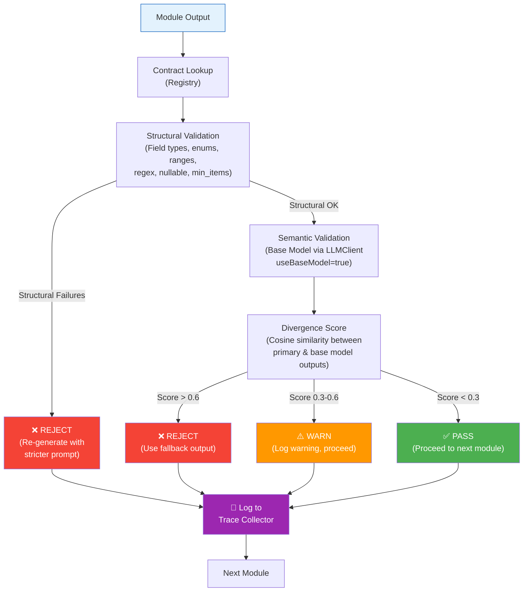
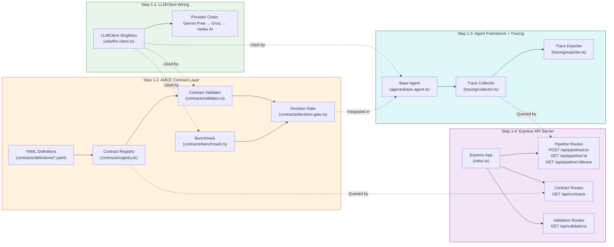
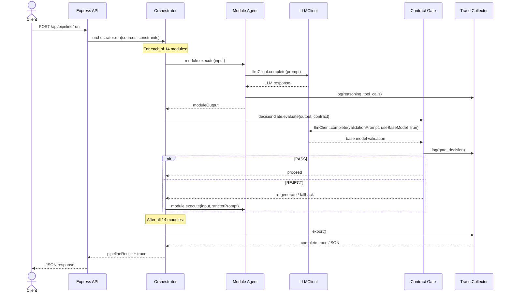
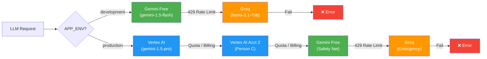

# Phase 1: Workflow Diagrams

> **Challenge 1 — Autonomous Content-to-Action Agent**  
> Diagrams covering the 14-module pipeline architecture and Phase 1 core infrastructure workflows.

---

## 1. Full 14-Module Pipeline Architecture

The complete agent pipeline from content ingestion to audit logs, showing where the **AMCE Contract Enforcement Layer** intercepts every module output.

```mermaid
flowchart TB
    INPUT["📥 5+ Input Sources<br/>(PDF, URL, CSV, JSON, Real-time Feed)"]
    
    M1["Module 1<br/>Multi-Source Content Ingestion"]
    M2["Module 2<br/>Source Credibility Scorer"]
    M3["Module 3<br/>Noise Filter & Deduplication"]
    M4["Module 4<br/>Contradiction Detector"]
    M5["Module 5<br/>RAG-Powered Insight Extraction"]
    M6["Module 6<br/>Temporal Analysis Engine"]
    M7["Module 7<br/>Conflict Resolution Logic"]
    M8["Module 8<br/>Impact Analysis w/ Constraints"]
    M9["Module 9<br/>Action Chain Generator (3-5 Actions)"]
    M10["Module 10<br/>Constraint Validator"]
    M11["Module 11<br/>Action Chain Execution Simulator"]
    M12["Module 12<br/>Failure Recovery & Rollback Engine"]
    M13["Module 13<br/>Outcome Visualization"]
    M14["Module 14<br/>Agentic Workflow Trace & Audit Logs"]

    CEL{{"🛡️ AMCE Contract<br/>Enforcement Layer<br/>(After Every Module)"}}

    OUTPUT["📊 Final Output<br/>Insights + Actions + Simulation + Trace"]

    INPUT --> M1
    M1 --> CEL
    CEL --> M2
    M2 --> CEL
    CEL --> M3
    M3 --> CEL
    CEL --> M4
    M4 --> CEL
    CEL --> M5
    M5 --> CEL
    CEL --> M6
    M6 --> CEL
    CEL --> M7
    M7 --> CEL
    CEL --> M8
    M8 --> CEL
    CEL --> M9
    M9 --> CEL
    CEL --> M10
    M10 --> CEL
    CEL --> M11
    M11 --> CEL
    CEL --> M12
    M12 --> CEL
    CEL --> M13
    M13 --> CEL
    CEL --> M14
    M14 --> OUTPUT

    style INPUT fill:#4CAF50,color:#fff,stroke:#2E7D32
    style OUTPUT fill:#2196F3,color:#fff,stroke:#1565C0
    style CEL fill:#FF9800,color:#fff,stroke:#E65100
    style M1 fill:#E3F2FD,stroke:#1565C0
    style M2 fill:#E3F2FD,stroke:#1565C0
    style M3 fill:#E3F2FD,stroke:#1565C0
    style M4 fill:#FFEBEE,stroke:#C62828
    style M5 fill:#E8F5E9,stroke:#2E7D32
    style M6 fill:#E3F2FD,stroke:#1565C0
    style M7 fill:#FFEBEE,stroke:#C62828
    style M8 fill:#FFF3E0,stroke:#E65100
    style M9 fill:#FFF3E0,stroke:#E65100
    style M10 fill:#FFF3E0,stroke:#E65100
    style M11 fill:#F3E5F5,stroke:#6A1B9A
    style M12 fill:#F3E5F5,stroke:#6A1B9A
    style M13 fill:#E8F5E9,stroke:#2E7D32
    style M14 fill:#E0F7FA,stroke:#006064
```

---

## 2. AMCE Contract Enforcement — Decision Flow

Shows the internal logic of the Contract Enforcement Layer that validates every module output.

---

## 3. Phase 1 Core Infrastructure — Component Architecture

The four infrastructure pillars being built in Phase 1 and how they interconnect.

---

## 4. Phase 1 Build Order — Dependency Graph

Shows the sequential build order with dependencies between components.

```mermaid
gantt
    title Phase 1 Build Order (6-8 hours)
    dateFormat HH:mm
    axisFormat %H:%M

    section Step 1.1 - LLMClient
    Audit agent imports           :s11, 00:00, 30m
    Fix direct SDK imports        :s12, after s11, 30m
    Create singleton smoke test   :s13, after s12, 15m

    section Step 1.2 - Contracts
    Audit registry.ts             :s21, after s13, 30m
    Audit validator.ts            :s22, after s21, 45m
    Create decision-gate.ts       :s23, after s22, 60m
    Create benchmark.ts           :s24, after s22, 45m
    Verify/create YAML defs       :s25, after s21, 30m
    Test contract validation      :s26, after s23, 15m

    section Step 1.3 - Agents/Tracing
    Audit base.agent.ts           :s31, after s23, 30m
    Audit collector.ts            :s32, after s31, 30m
    Audit exporter.ts             :s33, after s32, 30m
    Verify trace format           :s34, after s33, 15m

    section Step 1.4 - Express API
    Audit index.ts                :s41, after s34, 20m
    Audit pipeline.routes.ts      :s42, after s41, 20m
    Create contracts.routes.ts    :s43, after s42, 20m
    Create validations.routes.ts  :s44, after s43, 20m
    Integration test              :s45, after s44, 30m
```

---

## 5. Data Flow Per Pipeline Request

How a single pipeline request flows through Phase 1 infrastructure.

---

## 6. LLMClient Provider Fallback Chain

